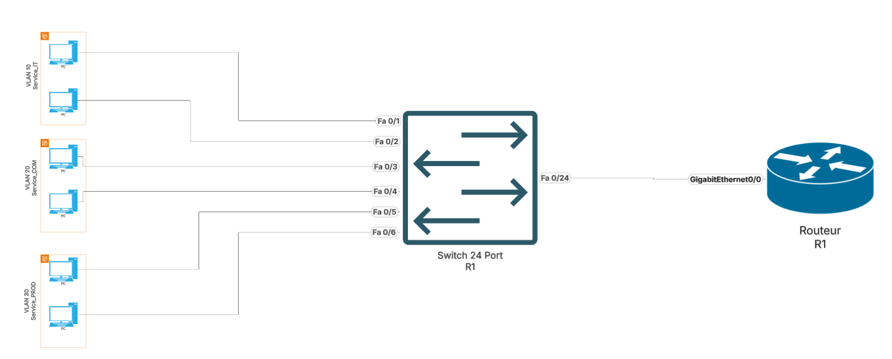

# IOS CISCO - Generalités

## ✅ Qu'est-ce que IOS ? 


Cisco IOS (Internetwork Operating System) est le système d'exploitation des équipements Cisco (switches, routeurs, firewalls). Il permet de :  
✔ Configurer et gérer les équipements réseau.  
✔ Superviser le trafic et diagnostiquer les pannes.  
✔ Appliquer des politiques de sécurité et de routage.  

## 📌 Modes d’IOS

Cisco IOS fonctionne en plusieurs modes :

Quelques commandes de bases :  

|									|											|
|---------------------------------------|---------------------------------------|
|``show running-config  ``					|# Voir la config en cours  |
|``show startup-config `` 					|# Voir la config de démarrage  |
|``copy running-config startup-config``  	|# Sauvegarde la config  |
|``erase startup-config `` 					|# Supprime la config de démarrage  |
|``reload `` 								|# Redémarre l’équipement  |
|``show ip interface brief ``				|# Affiche le résumé des IP  |
|``show interfaces status ``				|# Affiche l’état des interfaces  |
|``show interfaces ``						|# Affiche les interfaces  |

## 🔒 Sécurisation des lignes physiques et distantes

Mise en place d’un mot de passe sur la ligne physique (port console) 0 :   
```bash
line console 0 
password ####   
login  
end
```
Possibilité de faire la même chose pour une connexion telnet ou ssh (VTY)  
```bash
line console vty 0 15  
password ####   
login  
end 
```
Mise en place d’un mot de passe sur le mode privilège (enable)
```bash
configure terminal  
enable secret ####  
exit
```
Chiffrer les mots de passes de la config globale  
```bash
configure terminal  
service password-encryption
```

## Port VTY (Virtual Teletype) sur Cisco
Le port VTY est utilisé pour les connexions à distance sur un équipement Cisco via Telnet ou SSH.  
📌 Ce qu'il permet :  
✔ Accéder à un routeur ou un switch à distance.  
✔ Gérer plusieurs sessions simultanées (0 à 15).  
✔ Renforcer la sécurité avec un mot de passe ou SSH.  

Configuration de base des ports VTY  
Par défaut, Cisco autorise 16 ports VTY (VTY 0 à 15), mais seuls VTY 0 à 4 sont activés.  
Configuration des ports VTY avec SSH (Sécurisé 🔐)  
Attention, par défaut, les ports VTY utilisent le telnet, non sécurisé  
Étapes pour sécuriser l'accès avec SSH :
- Activer SSH sur le switch/routeur.  
- Configurer un nom de domaine et une clé RSA.
- Restreindre les ports VTY à SSH uniquement.  

```bash
enable
configure terminal							# Entre en mode configuration globale
hostname Switch           					# Définition d'un nom (obligatoire pour SSH)
ip domain-name monreseau.com				# Définition d'un domaine
crypto key generate rsa 	 				# Génération de la clé RSA (1024 bits minimum)
username admin privilege 15 secret Cisco123	# Création d'un utilisateur avec un mot de passe

line vty 0 15
login local               					# Utilisation de l'authentification locale
transport input ssh         				# Désactive Telnet, active SSH uniquement
exit										# Sort du mode courant 
```

<span style="color:red"> Remplace le mot de passe définit en vty (telnet) ne remplace pas le mot de passe privilège /<span> 


**Vérifier et gérer les connexions VTY**  

💡 Vérifier les connexions en cours : 
```bash
show users  # Affiche les utilisateurs connectés en VTY  
show line vty 0 4  # Infos sur l'état des sessions VTY  
```


💡 Forcer la déconnexion d'un utilisateur :  
```bash
clear line vty 2  			# Déconnecte l'utilisateur sur le port VTY 2
```

# Switches : VLAN, Trunk, Ports

Les switches segmentent un réseau en plusieurs VLANs et transportent ces VLANs via des trunks.  

## ✅ Les VLANs
Un VLAN (Virtual LAN) permet de séparer logiquement un réseau physique en plusieurs sous-réseaux indépendants.  
✔ Isolation du trafic (Ex: VLAN 10 pour les Admins, VLAN 20 pour les Étudiants)  
✔ Meilleure sécurité et réduction des collisions  
✔ Optimisation du trafic  

💡 Commandes de base pour créer et attribuer un VLAN :  

```bash
enable	
configure terminal
vlan 10         				# Création du VLAN 10
name Admin               		# Nommage du VLAN
exit
interface FastEthernet 0/1 		# Sélection du port
switchport mode access 			# Définit le mode accès
switchport access vlan 10 		# Assigne le VLAN 10 au port
no shutdown						# Activer le VLAN
exit
```


## ✅ Trunking : Communication entre VLANs
Les VLANs sur un switch ne peuvent pas communiquer entre eux sans un routeur ou un switch de niveau 3.  
Le trunking permet de transporter plusieurs VLANs sur un même lien entre deux switches.  
💡 Commandes pour configurer un Trunk :  

interface GigabitEthernet 0/1  
switchport mode trunk                	# Active le mode trunk  
switchport trunk allowed vlan 10,20  	# Autorise VLAN 10 et 20  
no shutdown  
exit  


# Routeurs : Inter-VLAN, RIP, Autres Protocoles

Les routeurs connectent plusieurs réseaux et permettent le routage entre VLANs.


## ✅ Inter-VLAN Routing (Routage entre VLANs)
Un switch ne peut pas faire communiquer plusieurs VLANs.  
Solution :
- Router-on-a-stick : Un routeur utilise une seule interface en trunk pour gérer plusieurs VLANs.
- Switch L3 (MLS - Multi-Layer Switching) : Un switch de niveau 3 effectue le routage.

💡 Configuration Router-on-a-stick
```bash 
interface GigabitEthernet 0/0
no shutdown
interface GigabitEthernet 0/0.10      	# Sous-interface VLAN 10
encapsulation dot1Q 10
ip address 192.168.10.1 255.255.255.0
interface GigabitEthernet 0/0.20      	# Sous-interface VLAN 20
encapsulation dot1Q 20
ip address 192.168.20.1 255.255.255.0
exit 
```

## Protocole de Routage RIP
RIP (Routing Information Protocol) est un protocole de routage dynamique basé sur la distance.  
Il permet lorsqu’il y a plusieurs routeurs de toujours choisir le chemin le plus court.   
🚨 Limite : Convergence lente, métrique max de 15 sauts.  

💡 Configuration RIP v2  
```bash
router rip
version 2
network 192.168.10.0
network 192.168.20.0
no auto-summary
exit
```

  


## NAT (Network Address Translation)

Le **NAT (Network Address Translation)** est une technique utilisée pour **modifier les adresses IP dans les en-têtes des paquets** de données lorsqu'ils traversent un routeur ou un pare-feu.   
Elle permet de **résoudre des problèmes liés à la pénurie d'adresses IPv4** en masquant les adresses privées du réseau interne derrière une adresse publique.  


### Pourquoi utiliser le NAT ?
- Économiser des adresses IP publiques : Le NAT permet à plusieurs appareils sur un réseau privé de partager une seule adresse IP publique pour se connecter à Internet. Cela est particulièrement utile car les adresses IPv4 sont limitées.
- Sécuriser les réseaux privés : Le NAT masque les adresses IP privées des utilisateurs internes, rendant le réseau interne moins vulnérable aux attaques externes.
- Faciliter la gestion des réseaux : Le NAT permet de configurer un réseau interne sans avoir à gérer des adresses IP publiques pour chaque appareil.  

### Types de NAT
**Static NAT (NAT statique)**  
C'est une traduction un à un entre une adresse IP privée et une adresse IP publique. Elle est utilisée lorsque tu veux que certains hôtes du réseau interne aient une adresse IP publique fixe.  

Exemple : Un serveur web interne avec une adresse privée 192.168.1.10 peut être mappé de manière statique à une adresse publique 203.0.113.10 pour que les utilisateurs externes puissent y accéder.  

Commandes :  
```bash
enable
configure terminal
ip nat inside source static 192.168.1.10 203.0.113.10  						# Associe 192.168.1.10 à 203.0.113.10
```

**Dynamic NAT (NAT dynamique)**  

Le Dynamic NAT associe une adresse IP privée à une adresse IP publique d'un pool d'adresses. Ce type de NAT est utilisé lorsque tu as plusieurs hôtes internes qui doivent accéder à Internet, mais que tu ne veux pas leur attribuer une adresse publique fixe.  

📌 Exemple : Si tu as un réseau avec plusieurs ordinateurs internes, le NAT dynamique va les traduire à partir d'un pool d'adresses publiques disponibles pour l'accès à Internet.  

Commandes :  
```bash
enable
configure terminal
ip nat pool public-pool 203.0.113.10 203.0.113.20 netmask 255.255.255.0  	# Déclare un pool d'IP publiques
ip nat inside source list 1 pool public-pool  								# Utilisation du pool pour la traduction
access-list 1 permit 192.168.1.0 0.0.0.255  								# Définir les adresses privées autorisées
```


**PAT (Port Address Translation)**, aussi appelé NAT Overload

Le PAT permet de traduire plusieurs adresses IP privées en une seule adresse IP publique mais avec des numéros de port différents. Cela permet à plusieurs hôtes internes de partager une même adresse publique pour l'accès à Internet.  

📌 Exemple : Tous les ordinateurs dans un réseau local peuvent partager une seule adresse IP publique pour accéder à Internet, mais chaque connexion sortante aura un numéro de port unique.  

Commandes de configuration :  
```bash
enable
configure terminal
ip nat inside source list 1 interface Ethernet0 overload  					# Utilise l'interface externe et active le PAT
access-list 1 permit 192.168.1.0 0.0.0.255  								# Définir les adresses privées autorisées
```