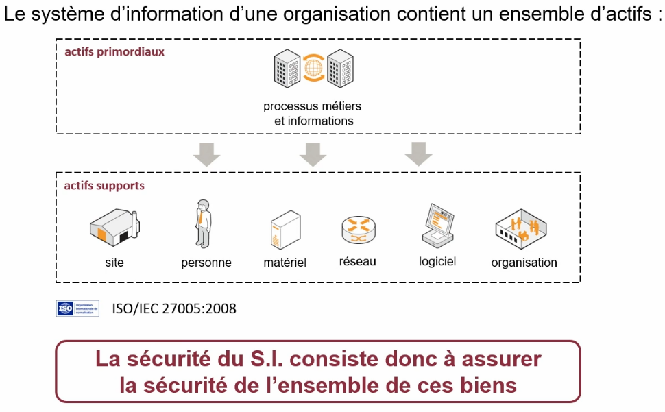

CyberEdu

# DICP

Les critères DICP sont des principes fondamentaux en cybersécurité qui permettent d'assurer la protection des données et des systèmes informatiques. L'acronyme DICP signifie :  
- Disponibilité (D)
- Intégrité (I)
- Confidentialité (C)
- Preuve (P) (ou Traçabilité)

## Disponibilité (D)
📌 Définition :  
La disponibilité signifie que les systèmes, services et données doivent être accessibles aux utilisateurs autorisés quand ils en ont besoin.  

🚨 Menaces :  
Attaques par Déni de Service (DoS/DDoS) : Inondation du réseau pour rendre un service inaccessible.  
Pannes matérielles ou logicielles : Défaillance des serveurs, crash de bases de données.  
Erreurs humaines : Mauvaise configuration entraînant des interruptions.  

✅ Solutions :  
Redondance et sauvegardes (RAID, sauvegardes régulières).  
Plans de reprise d’activité (PRA) et de continuité (PCA).  
Protection contre les attaques DDoS (firewalls, filtrage de trafic).  

## Intégrité (I)
📌 Définition :  
L’intégrité garantit que les données ne sont ni modifiées ni altérées de manière non autorisée.

🚨 Menaces :  
Attaques par injection SQL : Modification de bases de données par des commandes malveillantes.  
Altération de fichiers : Modification de logs ou de fichiers sensibles.  
Erreur humaine ou logicielle : Mauvaise manipulation des données.  

✅ Solutions :  
Hachage des données (SHA-256, MD5 avec sel pour vérifier l'intégrité).  
Contrôles d'accès stricts (ACL, permissions sur fichiers).  
Signature numérique et certificats (pour garantir l’authenticité des fichiers).  

## Confidentialité (C)
📌 Définition :  
La confidentialité assure que seules les personnes autorisées peuvent accéder aux informations sensibles.  

🚨 Menaces :  
Espionnage, vol de données (exfiltration de données sensibles).  
Attaques par phishing (vol d’identifiants).  
Mauvaise gestion des permissions (accès non autorisé aux fichiers).  

✅ Solutions :  
Chiffrement des données (AES, RSA, TLS pour protéger les communications).  
Authentification forte (MFA, cartes à puce, biométrie).  
Segmentation des accès (Zero Trust, principe du moindre privilège).  

## Preuve / Traçabilité (P)
📌 Définition :  
La traçabilité garantit qu’il est possible de retrouver l'origine d'une action et de prouver qui a fait quoi et quand.  

🚨 Menaces :  
Effacement des logs pour masquer des actions frauduleuses.  
Usurpation d’identité sans possibilité d’en retrouver l’origine.  
Absence de supervision et d’audit permettant aux menaces de passer inaperçues.  

✅ Solutions :  
Journaux et logs sécurisés (Syslog, SIEM pour centraliser et analyser les logs).  
Contrôle des accès avec horodatage (audit des connexions).  
Gestion des identités et authentification forte (IAM, SSO).  

## Récapitulatif des Critères DICP en Cybersécurité

Exemple d'Évaluation DICP en Cybersécurité  
Lors d’un audit de sécurité, une évaluation DICP est réalisée pour analyser la protection des données et des systèmes d’information. Voici un exemple d'évaluation pour un serveur web hébergeant des données sensibles.  

📌 Contexte

Entreprise : Société de e-commerce  
Système analysé : Serveur web (Apache) hébergeant des données clients  
Objectif : Évaluer la sécurité selon les critères DICP  

📊 Évaluation des critères DICP  

🔍 Rapport Final et Actions Correctives  
🔴 Problèmes critiques détectés :  
- Absence de protection DDoS ➝ Vulnérabilité aux attaques par saturation du service.  
- Connexion en HTTP non sécurisé ➝ Risque d’interception des identifiants clients.  
  
🟢 Actions recommandées :  
- ✅ Activer un pare-feu anti-DDoS et un CDN.
- ✅ Appliquer des politiques strictes de chiffrement (forcer HTTPS).
- ✅ Mettre en place un SIEM pour la centralisation des logs.  
  

📌 Conclusion  
L’évaluation DICP a permis d’identifier des faiblesses majeures en confidentialité et disponibilité. L’entreprise doit renforcer la sécurité pour prévenir les cyberattaques et la perte de données.  
Tu veux un exemple détaillé sur un autre type de système (routeur, cloud, base de données) ? 🔥  
4o

# Différence entre Vulnérabilité, Menace et Attaque en Cybersécurité

En cybersécurité, ces trois concepts sont liés mais distincts :
- Vulnérabilité : Une faiblesse ou faille dans un système qui peut être exploitée.
- Menace : Un danger potentiel qui pourrait exploiter une vulnérabilité.
- Attaque : L’exploitation réelle d’une vulnérabilité par un acteur malveillant.

## Vulnérabilité (Faiblesse du système)

📌 Définition :  
Une vulnérabilité est une faille dans un système, une application ou une configuration qui peut être exploitée pour compromettre la sécurité.  

🚨 Exemples de vulnérabilités :  
Logicielle : Bug dans un programme (ex. buffer overflow).  
Matérielle : Processeur vulnérable (ex. Spectre/Meltdown).  
Humaine : Mauvaise gestion des mots de passe (ex. "123456").  
Configuration : Port SSH ouvert sans restriction.  

✅ Solutions :  
Appliquer des mises à jour et correctifs (patch management).  
Renforcer les politiques de sécurité (authentification forte, MFA).  
Auditer et tester régulièrement avec des scanners de vulnérabilités (Nessus, OpenVAS).  

## Menace (Le danger potentiel)
📌 Définition :  
Une menace est un acteur ou un événement qui pourrait exploiter une vulnérabilité pour causer un dommage.  

🚨 Exemples de menaces :  
Cybercriminels : Hackers cherchant à voler des données.   
Malwares : Virus, ransomwares, chevaux de Troie.  
Erreurs humaines : Employé envoyant un email à la mauvaise personne.  
Catastrophes naturelles : Panne électrique, incendie impactant un datacenter.  

✅ Solutions :  
Mettre en place un pare-feu (firewall) et un antivirus.  
Former les utilisateurs pour éviter les erreurs humaines.  
Élaborer des plans de continuité (PCA/PRA).  

## Attaque (L’action réelle)
📌 Définition :  
Une attaque est une action malveillante qui exploite une vulnérabilité pour causer un dommage.  

🚨 Exemples d’attaques :  
Phishing : Email frauduleux pour voler des identifiants.  
Injection SQL : Piratage d’une base de données via une requête malveillante.  
Ransomware : Logiciel qui chiffre les fichiers et demande une rançon.  
Déni de service (DDoS) : Saturation d’un serveur pour le rendre indisponible.  

✅ Solutions :  
Détecter et bloquer les attaques avec des SIEM et IDS/IPS.  
Appliquer une segmentation réseau pour limiter l’impact.  
Sauvegarder régulièrement les données pour se protéger des ransomwares.  

# Quelques menaces

## Phishing 🎣
📌 Définition :  
Le phishing (hameçonnage) est une technique où un attaquant usurpe une identité (banque, entreprise, service en ligne) pour tromper la victime et lui voler des informations sensibles (identifiants, mots de passe, numéros de carte bancaire).  

🎭 Méthodes utilisées :  
Email frauduleux (ex. : "Votre compte PayPal est bloqué, cliquez ici pour le réactiver").  
Faux sites web imitant des pages officielles pour récupérer des identifiants.  
SMS ou appels téléphoniques (smishing et vishing).  

## Ingénierie Sociale 🧠🎭  
📌 Définition :  
L’ingénierie sociale est une technique de manipulation psychologique utilisée par les hackers pour pousser une personne à révéler des informations sensibles ou à exécuter une action compromettante.  

🎭 Méthodes utilisées :  
Prétexte convaincant : Se faire passer pour un collègue ou un technicien IT.  
Exploitation de la peur ou de l’urgence : "Votre compte va être désactivé si vous ne répondez pas immédiatement".  
Attaque en personne : Un individu entre dans une entreprise en prétendant être un technicien et branche une clé USB infectée.  

## Attaque par Tête de Pont (Pivot Attack) 🔗
📌 Définition :  
L’attaque par tête de pont consiste à compromettre un premier système faible, puis à l’utiliser comme un point d’accès pour attaquer d’autres parties du réseau.  

🔍 Fonctionnement :  
Compromission d’une machine peu sécurisée (ex. un PC mal protégé).  
Prise de contrôle par un attaquant qui installe un malware ou un outil d’accès distant.  
Déplacement latéral : Il explore et attaque d’autres systèmes internes (serveurs, bases de données).  

## 📌 Fraude Interne en Cybersécurité
La fraude interne désigne les actes malveillants commis par un employé, un prestataire ou une personne interne à l’organisation pour détourner des ressources, manipuler des informations ou compromettre la sécurité.  

🚨 Pourquoi est-elle dangereuse ?  
Contrairement aux cyberattaques externes, la fraude interne est plus difficile à détecter car l’attaquant a déjà des accès légitimes au système.  

1️⃣ Types de Fraudes Internes  

Facteurs Favorisant la Fraude Interne  
✅ Accès trop larges : Les employés ont plus de droits que nécessaire.  
✅ Absence de surveillance : Pas de journalisation ou d’audit des actions sensibles.  
✅ Manque de formation : Les employés ignorent les règles de cybersécurité.  
✅ Motivations personnelles : Revanche, besoin d’argent, pression externe (chantage).  

- **80%** des domaines Active Directory sont compromis en 2 heures
- **75%** des domaines Active Directory contiennent au moins 1 compte privilégié avec un mot de passe trivial
- **50%** des entreprises sont affectées par un défaut de cloisonnement de ses réseaux
- **80%** des tests d’intrusion ne sont pas détectés par les équipes IT

## Virus Informatique : Définition, Types et Protection
Un virus informatique est un programme malveillant conçu pour infecter, endommager ou perturber un système informatique. Il se propage en s’attachant à des fichiers ou programmes légitimes et s’active lorsque l’utilisateur exécute l’hôte infecté.  
🚨 Différence avec un malware ?  
🔹 Un malware (malicious software) est un terme général pour tous les logiciels malveillants (virus, ransomware, trojan, etc.).  
🔹 Un virus est un type spécifique de malware qui se réplique en infectant des fichiers.

Caractéristiques d’un Virus Informatique  
✅ Se propage en infectant des fichiers légitimes (ex. documents, exécutables).  
✅ S’active lorsque l’utilisateur exécute le fichier infecté.  
✅ Peut modifier, supprimer ou chiffrer des fichiers.  
✅ Peut ralentir un système ou le rendre inutilisable.  

### Types de Virus Informatiques  

Comment un Virus se Propage ?  
📂 Fichiers infectés (ex. un email contenant un fichier malveillant).  
💾 Supports amovibles (ex. clé USB contaminée).  
🌐 Sites web compromis (ex. téléchargement d’un faux logiciel).  
📩 Emails et pièces jointes (ex. document Word contenant un virus macro).  
🔗 Réseaux P2P et torrents (ex. faux cracks de logiciels).  

## Attaque DDoS (Distributed Denial of Service)

Une attaque DDoS (Déni de Service Distribué) vise à saturer un serveur, un réseau ou un site web en générant un trafic massif et artificiel, empêchant les utilisateurs légitimes d’y accéder.  

🚨 Différence entre DoS et DDoS  
- DoS (Denial of Service) : Attaque provenant d’une seule machine.
- DDoS (Distributed Denial of Service) : Attaque menée par plusieurs machines infectées (réseau de bots ou botnet).

### Fonctionnement d’une Attaque DDoS 

🔗 Étapes d’une attaque DDoS :  
1️. Création d’un Botnet 🦠 : L’attaquant infecte des milliers d’ordinateurs/objets connectés (IoT, PC, serveurs) avec un malware.  
2️. Commande d’attaque 📡 : L’attaquant envoie un ordre aux machines infectées (zombies).  
3️. Saturation de la cible 🔥 : Le botnet envoie des millions de requêtes pour épuiser les ressources du serveur cible.  

