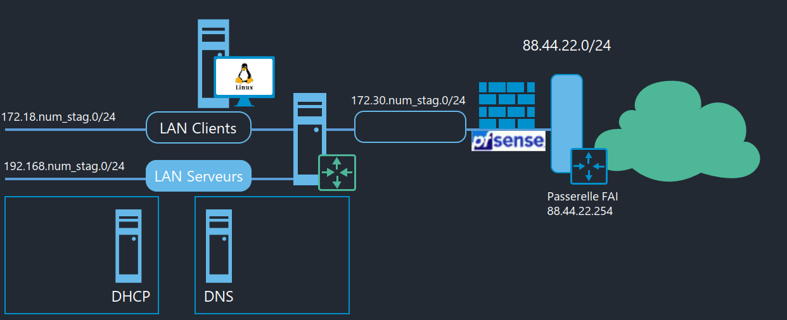
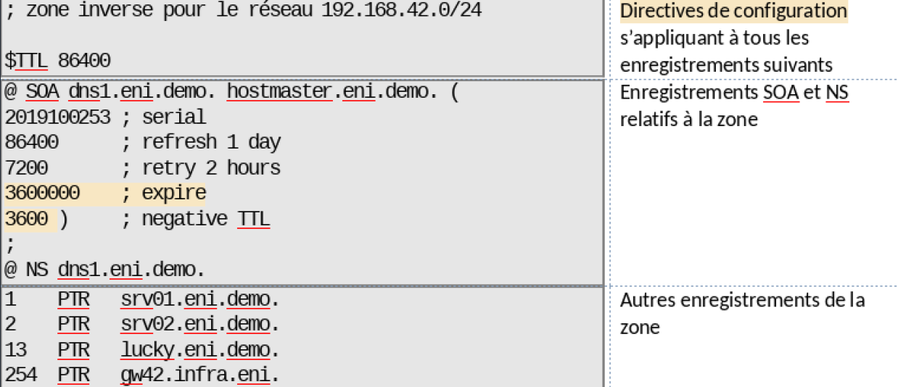
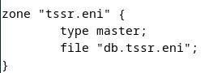
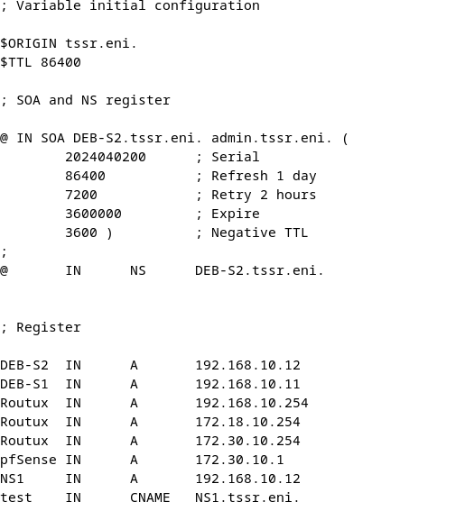
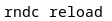

# Structure du sandbox


Adresse IP FAI : 192.168.1.1

# Adressage réseau
## Nommage des cartes réseaux

Interface looback (lo) : ``127.0.0.1``  

Trois manières de configurer une carte réseau :
- La commande IP
  - Configuration dynamique (prise en compte immédiatement)
  - Configuration non stabilisée (non conservée au redémarrage)
- Le fichier interfaces
  - Configuration stabilisée
  - Configuration non dynamique
- Via le network manager


## La commande IP
``ip ``[ OPTIONS ] OBJECT { COMMAND | help }

OBJECT := { link | addr | addrlabel | route | rule | neigh | ntable | tunnel | tuntap |
            maddr | mroute | mrule | monitor | xfrm | netns | l2tp }

🧠 Explication rapide :  
- ip : commande principale
- OPTIONS : options globales (ex : -4 pour IPv4, -6 pour IPv6)
- OBJECT : type d’objet sur lequel on agit (ex : link pour les interfaces, addr pour les adresses IP)
- COMMAND : action à exécuter (ex : show, add, del, etc.)


```shell
ip a                                # liste les interfaces réseaux et voir leurs configurations.
ip a add @IP @Interface             # Ajouter une adresse - ex :  ip a add 10.11.12.13/24 dev ens33
ip a del @IP @Interface             # Retrait adresse IP
ip a flush ens33                    # flush la config de l’interface ens33
ip link set ens33 down              # Désactive l’interface ens33
ip link set ens33 up                # Active l’interface ens33
ip r                                # Affiche la table de routage
```

## Le fichier Interfaces
Disponible dans /etc/network/interfaces
```bash
auto en33                           # Démarrage auto de l’interface au démarrage de la machine
iface ens33 inet static             # Configuration statique pour l’interface ens33
iface ens33 inet dhcp               # Configuration dynamique via DHCP
```
Nécessite un redémarrage du service networking.

## Network manager

Commande nmcli ou nmtui avec interface graphique.  
Modification d’une IP avec nmcli : ``nmcli connection modify Wired\ connection\ 1 ipv4.adresse 192.168.66.6/24``
```shell 
# Modifie la connexion nommée Wired connection 1 pour lui attribuer l’adresse IP statique 192.168.66.6/24
nmcli connection modify Wired\ connection\ 1 ipv4.addresses 192.168.66.6/24 
# Spécifie que la configuration IPv4 doit être manuelle (et non automatique via DHCP). Obligatoire pour que l’adresse définie soit prise en compte.
nmcli connection modify Wired\ connection\ 1 ipv4.method manual
# Ajoute une seconde adresse IP (alias) sur la même interface. Le + permet d’ajouter sans écraser l’adresse précédente.


nmcli connection modify Wired\ connection\ 1 +ipv4.addresses 192.168.1.1/24
```` 


## Configuration de la gateway

Avec NM (network manager) : ``nmcli connection modify Wired\ connection\ 1 ipv4 gateway 192.168.1.1  ``  
Dans le fichier interface : ``Ajouter la ligne « gateway 192.168.1.1 »  ``  
Avec la commande ip :
```shell 	  
ip r add default via 192.168.1.1        # Ajoute une route par défaut  
ip r change default via xxxx            # Change la route par défaut  
```

## Nom d’hôte
Il peut être définit en temps que nom court ou nom FQDN.  
Le nom d’hôte se trouve dans :  
/etc/hostname  
/etc/hosts  Pour pouvoir le résoudre localement sans serveur DNS  
Commande ``hostname`` pour voir le nom de la machine.  

## Client DNS

Dans le fichier /etc/resolv.conf  : Emplacement du serveur DNS de la machine  
L’ordre de résolution est défini dans le fichier /etc/nsswitch.conf  

Pour indiquer un serveur DNS à utiliser :  
NM : ``nmcli connection modify Wired\ connection\ 1 ipv4.dns 192.168.1.1``  

Resolv.conf :  
```shell
search ad.campus-eni.fr demo.eni 	# Définition des suffixes DNS
domaine ad.campus-eni.fr 	        # Définition du nom de domaine principal
nameserver 10.0.0.3	                # Serveur DNS
nameserver 10.100.0.3	            # Serveur DNS
```

En DHCP, cette config est gérée via le serveur DHCP.

# Le routage

Trois types de route :  
- Route d’hôte pour attendre une machine spécifique
- Route de réseau (sur les routeurs)
- Route par défaut

Commande : ``ip route / ip r``

Par defaut une machine linux ne fait pas routeur mais cette option peut être activée dans /etc/sysctlconf en indiquant ``net.ipv4.ip_forward=1``  
Puis lancer la commande ``sysctl=p``


Sur PF sense, vérifier que le NAT est bien sur **outbound**

# Administration à distance
## Protocole SSH

Paquet à installer coté serveur : **openssh-client**  
Coté client, on peut installer : **Putty, mRemoteNG ou MobaXterm**

Copier des fichiers en ssh avec la commande :
``scp user@ip:/chemininitial /chemindestination``

## Accès par clé ssh
Lors de transfert / connexion régulière à une machine distante, il peut être dérangeant de toujours devoir se log avec user et mdp.  
Ces clés ssh peuvent nous permettre :  
- De nous connecter plus rapidement
- Automatiser le transfert de fichier entre machine

Pour générer ces clés, on va utiliser le commande ``ssh-keygen``  
Obtention d’une paire de clé :
- Privée (stockée en local et à backuper)
- Public à installer sur les serveurs pour se connecter  
Lorsque la clé est créée, il faut copier la clé publique avec la commande
``ssh-copy-id user@ip``

Il est impossible de se connecter en ssh avec root mais il est possible de le faire avec une clé ssh. Pour cela :
1. Vérifier que le répertoire .ssh existe dans /root
2. Faire un chmod 700 sur le repertoire .ssh
3. Ajouter la clé authorized_key dans le repertoire ssh
Par defaut, la clé se trouve dans le $HOME/.ssh du user ayant copié la clé  
Je peux me connecter sur ma machine distante avec root

# Le DNS résolveur
Il permet la correspondance entre un FQDN et une adresse IP.
Voir le cours windows

## Mise en place
Utilisation du paquet ``bind9`` (service bind9) + ``dnsutils`` (commande de résolution DNS, optionnel)  

- Commandes du fichier /etc/bind/named.conf  
```shell
named-checkconf                         # Vérifie le fichier de configuration
named-checkzone                         # Vérifie le fichier de zone
rndc reload ou systemctl restart bind9  # Recharger la config
``` 

- Option du fichier **/etc/bind/named.conf**

```conf
// rsxclts = réseaux des postes clients de l’entreprise
acl rsxclts { 127.0.0.0/8; 192.168.53.0/24; 192.168.1.0/24; };

include /etc/bind/named.conf.options ;
include /etc/bind/named.conf.local ;
include /etc/bind/named.conf.default-zones ;
```

- Option du fichier «named.conf.options»  

```shell
forward only;                 #  Bind n’utilisera QUE les serveurs spécifiés dans forwarders, et pas la résolution récursive classique.
forwarders {@IP;};            # permet une redirection des requetes DNS vers l’IP spécifiée
allow-query {@IP;};           # permet la réponse depuis le serveur DNS à une liste d’IP spécifique (ACL)
allow-recursion {@IP;};       # restriction des hôtes autorisés à adresser des requêtes récursives
listen on v6 : none           # Desactive l'écoute sur IPv6
dnssec-enable no ;            # Le serveur n’utilisera pas DNSSEC pour signer ses zones.
dnssec-validation no;         #  Il ne validera pas les réponses signées par d’autres serveurs.
```

- Exemple de configuration named.conf.options
```conf
options {
    // Répertoire de travail de Bind9
    directory "/var/cache/bind";

    // Redirection exclusive (pas d’appel aux racines en cas d’indisponibilité)
    // vers les serveurs Quad9
    forward only;
    forwarders { 9.9.9.9; };

    // Restriction des hôtes auxquels répond le serveur
    allow-query { rsxclts; };

    // Restriction des hôtes autorisés à adresser des requêtes récursives
    allow-recursion { rsxclts; };

    // Communication DNSSEC désactivée
    dnssec-enable no;
    dnssec-validation no;

    // Information de version non communiquée
    version none;
};
```
## En pratique
Lorsque le DNS est configuré, l’adresse IP du DNS (nameserver) se trouve dans ``/etc/resolv.conf``  
Si le résultat est une ipv6, il est possible de la désactiver en allant dans ``/etc/sysctl.conf`` et ajouter :  
``net.ipv6.conf.all.disable_ipv6 = 1`` puis ``sysctl -p`` pour valider.  

*Lors de longue reponse, rajouter le | more pour faire defiler les pages* 

Commande :  
``dig `` = ``tracert`` avec le paquet **dnsutils**

# DHCP
Le PC arrive sur le réseau et commence le Discover Offer Resquest Ack pour obtenir une adresse IP du serveur DHCP  
Pour mettre en place le serveur DHCP, il y a deux solutions majeures :  
- isc-dhcp-server – Le plus utilisé, le plus vieux
- kea – Le plus recent, pas encore très utilisé

## Mise en place d’un relai DHCP
Un relai DHCP nous servira si le serveur DHCP n’est pas positionné sur le même réseau que nos clients.
Paquet ``isc-dhcp-relay``

Configuration du Fichier **/etc/default/isc-dhcp-relay**
```bash
# vi /etc/default/isc-dhcp-relay

# Defaults for isc-dhcp-relay initscript

# What servers should the DHCP relay forward requests to?
SERVERS="192.168.42.2"

# On what interfaces should the DHCP relay (dhrelay) serve DHCP requests?
INTERFACES="ens33 ens35"

# Additional options that are passed to the DHCP relay daemon?
OPTIONS=""
```

## Installation en pratique

Installation du paquet ``isc-dhcp-server``.  
Après l’installation, aucune configuration n’est encore mise en place, le service sera donc en erreur, ce qui est normal.  

Il faut faire la configuration des fichiers suivants :  
**etc/default/isc-dhcp-server**  

Ajouter les interfaces sur lesquels on veut proposer des adresses IP
Etc/dhcp/dhcpd.conf :  
```shell
option domain-name-servers 192.168.10.12 ; 	    # Adresse de DNS
default lease-time et max-lease-time;		    # Durée et intervalles des baux
authoritative ; 					            # Active l’autorité du serveur
log-facility local7 ; 			                # Redirige les log en local. Il faudra aussi modifier stslog.conf
subnet 192.168.10.0 netmask 255.255.255.0 {} 	# Active l’écoute sur le réseau 192.168.10.0
subnet 172.18.10.0 netmask 255.255.255 {		# Active l’écoute sur le réseau 172.18.10.0
Range 172.18.10.100 182.18.10.200 ;		        # Donne une plage d’adresse IP à fournir
option routers 172.18.10.254 ; }			    # Donne le routeur à utiliser
```

Valider la configuration et ``dhcpd -t`` pour tester la configuration. 
Activer le service avec ``systemctl start isc-dhcp-server``.    
Lors du changement de config client (static -> dhcp), faire un ``ip a flush ens36`` pour purger l’ancienne configuration puis un ``dhclient ens36 ``pour faire le **Discover de dora**.  
Les informations des baux sont stockées dans **/var/lib/dhcp/dhcpd.leases**

# DNS autoritaire sur zone

## DNS faisant autorité
C’est la source d’info pour un ou plusieurs domaines.  
Il sera **interrogé** par les serveurs **DNS résolveurs**  
Il peut héberger des zones primaires ou secondaires.   

Une zone est un ensemble d’information ayant une caractéristique commune :
- Partie d’un nom de domaine
- Reseau IP d’appartenance

Zone direct : Répertorie avec le nom de domaine  
Zone indirect : Répertorie avec l’adresse IP  

### Zone primaire :
Mis en place sur un serveur autoritaire  
Source d’info et source de modif (lecture et ecriture)  
Maitre  

### Zone secondaire :
Copie de la zone primaire donc ne fonctionne qu’en lecture  
Serveur esclave  
La notion de primaire et secondaire est à paramétrer au niveau de chaque zone.  


## Configuration d’un DNS faisant autorité

Les zones sont à paramétrer dans /etc/bind/named.conf.local

**Configuration pour une zone primaire direct :**
```shell
zone ‘’eni.demo’’  {		        # Nom de la zone
type master ;		                # Indique le type primaire
file ‘’db.eni.demo’’ ;	            # Les informations de zone seront dans le fichier db.eni.demo
allow-transfer { 10.11.0.53 ; } ;	# Autorise le transfert de zone vers 10.11.0.53
} ;
```
**Configuration pour une zone primaire invers :**
```shell
zone ‘’42.168.192.in-addr.arpa’’ {  # Nom de la zone
type master;                        # Indique le type primaire
file ‘’db.192.168.42.inv’’;         # Les informations de zone seront dans le fichier db.eni.demo
};
```
**Configuration pour une zone secondaire direct :**
```shell
zone ‘’eni.demo’’  {			    # Nom de la zone
type slave ;			            # Indique le type secondaire
masters {10.5.3.10 ; } ;		    # Indique le maitre
file ‘’db.eni.demo’’ ;	            # Les informations de zone seront dans le fichier db.eni.demo
allow-query { any; } ;	            # Autorise les requêtes clients
} ;
```

Le fichier de zone est db.eni.demo. On va distinguer 3 parties :   
*; point-virgule = commentaire en début / en cours de ligne*  

Attention, ce fichier doit se trouver dans le repertoire indiqué dans **/etc/bind/named.conf.option**

### 1. Définir deux variables :
```shell
$ORIGIN eni.ecole.bzh.		# Définit le nom du domaine
$TTL 86400		            # Définit le time to live (durée de conservation dans le cache DNS
```

### 2.Enregistrements des SOA (Nom du serveur maitre) et NS (Serveur faisant autorité pour la zone)

```dns
@  SOA dns1.eni-ecole.bzh. hostmaster.eni-ecole.bzh. (
        2019100253 ; serial
        86400      ; refresh 1 day
        7200       ; retry 2 hours
        3600000    ; expire
        3600 )     ; negative TTL
;

@  NS dns1.eni-ecole.bzh.
@  NS dns2.eni-ecole.bzh.
```
Avec

```shell
@ SOA dns1.eni-ecole.zsh.		# FQDN du DNS principal de la zone
Hostmaster.eni-ecole.bzh.	    # Email admin zone

Serial                          # sous le format AAAAMMJJxx  Doit être modifié à chaque modif
Refresh                         # Mise à jour tous les x
Retry                           # Si mon secondaire n’arrive pas à accéder à mon primaire, tous les cb doit il reesayer ?
Expire                          # Si mon serveur secondaire n’a pas réussit à requeter la primaire, expiration des infos

@ NS dns1.eni-ecole.bzh. 	    # Indique un serveur DNS gérant la zone
```

**Autres enregistrements de zone direct :**  

```dns
// Sous domaine 	/	Type d’enregistrement	/	Valeurs

dns1    A       44.0.5.3
dns1    AAAA    2001:0db8::ec01:e
dns2    AAAA    2001:0db8::ec01:e53

www     A       44.0.0.80
rdsgw   A       35.12.13.15
smtp    A       44.0.0.25

ww      CNAME   www.eni-ecole.bzh.
wwww    CNAME   www.eni-ecole.bzh.

@       MX 10   smtp.eni-ecole.bzh.
@       MX 20   mx0.mail.ovh.net.
```
Avec 
| Type d’enregistrement | Contenu                                                              |
|------------------------|----------------------------------------------------------------------|
| SOA                    | nom FQDN du serveur DNS disposant de la zone en **écriture**         |
| NS                     | serveur(s) **faisant autorité** pour la zone                         |
| A                      | Hôte IPv4                                                            |
| AAAA                   | Hôte IPv6                                                            |
| CNAME                  | Alias                                                                |
| MX                     | Serveur de messagerie                                                |
| SRV                    | Services                                                             |


Commencer par les correspondances avec nos serveur DNS (ici 1 et 2).  
Pour les @MX, le chiffre indique le poids. Le plus petit sera interrogé en premier. Smtp = mail  



## En pratique

On utilisera le IN (bonne pratique DNS) :  
@ IN SOA
@ IN NS
IN A
IN AAAA

Pour vérifier la syntaxe du fichier, exécuter la commande ``named-checkzone eleve.local /var/cache/bind/db.eleve.local``  
``rndc reload`` pour recharger la config de bind  
tester avec la commande ``dig elevel.local``.

Protocole complet :

1. Creation de la zone dans /etc/binf/named.conf.local



2. Creation du fichier db.tssr.eni dans /var/cache/bind



3. Test de la syntaxe de la configuration de zone


4. Reload de la zone


En cas d’erreur, vérifier dans le service bind9 avec systemctl status bind9.service.  
Sur le serveur DHCP, ajouter le suffixe DNS via « option domain-name ‘’tssr.eni’’  
Relancer le service DHCP et faire un ``flush`` sur la carte réseau du client et un ``dhclient `` 

**<span style="color:red"> Lors de la configuration d'un DNS secondaire, il est inutile de créér le fichier de zone. Celui-ci sera créé à partir du serveur maitre (export) et sera difficilement lisible (binaire brut)</span>**