# Services réseau en environnement Microsoft

# Administration windows serveur.

Deux familles de système d’exploitation :
- Serveur
- Client

## Comparatif des éditions Windows Server

| Édition       | Standard                                                                 | Datacenter                                                   | Essentials                                                                 |
|---------------|--------------------------------------------------------------------------|--------------------------------------------------------------|----------------------------------------------------------------------------|
| **Prise en charge matérielle (minimum)** | 512 Mo de RAM en mode Core<br>2 Go de RAM avec expérience utilisateur<br>CPU 1,64 GHz 64 bits<br>32 Go de stockage disque | 512 Mo de RAM en mode Core<br>2 Go de RAM avec expérience utilisateur<br>CPU 1,64 GHz 64 bits<br>32 Go de stockage disque | 2 Go de RAM<br>1,4 GHz 64 bits<br>160 Go de stockage avec une partition système de 60 Go |
| **Droits à la virtualisation**          | 2 VM + 1 hôte Hyper-V par licence                              | Nombre illimité de VM + 1 hôte Hyper-V par licence           | Hyper-V non disponible                                                    |
| **Mode de licence**                     | Basé sur les cœurs CPU                                          | Basé sur les cœurs CPU                                       | Licence serveur                                                           |

Services pris en charge par WS :  
- ADDS 		-> Gestion Active Directory
- DNS 		-> Service de résolution de nom d’hôte
- DHCP 		-> Service d’adressage IP
- Hyper-V 		-> Virtualisation
- Deploiement WDS 	-> Déploiement OS Windows dans le réseau
- WSUS		-> Prise en charge centralisée mise à jour Microsoft
- Service d’impression et numérisation de document

Possibilité d’installer WS :
- Mode standard : Mode graphique – Demande de ressource modérée
- Mode Core : CLI powershell uniquement – Demande peu de ressource


## Installation OS
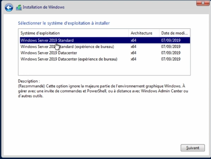  
Lors de l’installation :
Standard = Mode core
Standard (Expérience de bureau) = Mode graphique

Type d’installation :
Personnalisée (installer uniquement windows)

Pour le reste installation classique.

Lors de l’arrivée sur le bureau – Le dashboard apparait automatiquement.
Renommer la machine et faire la config IP.
Config IP : Panneau de config / réseaux / Modifier paramètre de la carte / IPV4 / Configurer l’adressage IP
Renommage PC : Explorateur / clic droit, propriété sur PC / Modifier les paramètre / Changer et redémarrer

### 🎯 Les rôles et fonctionnalités

#### 🔧 Des composants peuvent être ajoutés par :
- Le gestionnaire de serveur  
- Des commandes PowerShell

#### 🧩 Deux types de composants :
- **Les rôles** : correspondent généralement à un **service que l’on fournit à des clients**
- **Les fonctionnalités** : correspondent généralement à un outil/composant **utile sur l’élément sur lequel on l’ajoute**

Pour ajouter un rôle : 
1. Gérer (en haut à droite) / Ajouter des rôles et fonctionnalités  
2. Installer un rôle et une fonctionnalité  
3. Sélectionner le serveur  
4. Sélectionner le rôle à installer  
5. Ajouter des fonctionnalités  
6. Cocher redémarrage automatique puis installer  

Pour accéder aux outils d’administration : ``Windows / outils d’administration Windows``  


## Gestion du stockage

Deux types de tables de partitions :
- MBR (historique) : Pour les systèmes en 32 bits, legacy
  - Faible tolérance à la panne
- GPT (recent) : Pour les systèmes en 64 bits, UEFI
  - Meilleure tolérance aux pannes

**Configuration des disques **:
- Config de base
  - Simplifie la gestion de disque
  - Toutes les données sont inscrites dans les partitions
  - Sur un seul disque physique
- Config Dynamique
  - Système de volume pouvant être sur plusieurs disques
  - Nécessaire pour le raid.

## Partitionnement d’un disque et RAID

### 📦 Partitionnement

- **Disque de base** :  
  ➤ 4 partitions principales **ou** 3 principales + 1 étendue (logique)

- **Disque dynamique** :  
  ➤ Utilise des **volumes dynamiques** (⚠️ **ne peut pas héberger un OS**)

---

### 📁 Types de volumes

- 📄 **Volume simple** : 1 volume par disque  
- 🧩 **Volume fractionné** : Un ou plusieurs volumes répartis sur plusieurs disques  
- 🚀 **Volume agrégé par bande (RAID 0)** :  
  ➤ Écriture **simultanée** du fichier sur plusieurs disques  
  ➤ ✅ **Rapide**  
  ➤ ❌ **Aucune tolérance de panne**

---

### 🛡️ RAID – Tolérance de panne

- 🪞 **RAID 1 – Volume miroir** :  
  ➤ Copie exacte d’un disque sur un second  
  ➤ ✅ Tolérance aux pannes

- 🧬 **RAID X – Redondance personnalisée**

- ⚖️ **RAID 5 – Agrégé par bandes avec parité** :
  - Besoin de **3 disques minimum**
  - 1 disque (ou son espace équivalent) est réservé pour la **parité** (= tolérance de panne)
  - ✅ **Bon compromis** entre **performance** et **sécurité**
  

🗂️ Schéma de répartition RAID 5 (exemple avec 3 disques)

|         | 💽 Disque 1 | 💽 Disque 2 | 💽 Disque 3 |
|---------|-------------|-------------|-------------|
| Bloc 1  | A1          | A2          | Ap (parité) |
| Bloc 2  | Bp (parité) | B1          | B2          |
| Bloc 3  | C1          | Cp (parité) | C2          |

---

#### 🧠 Explication

- Le fichier à enregistrer est composé des blocs **A**, **B** et **C**.
- Chaque information est répartie sur **plusieurs disques**.
- **Ap**, **Bp**, **Cp** sont des blocs de **parité** : ils permettent de **reconstruire les données** si un disque tombe en panne.

---

#### ✅ Avantages

- ✅ **Performance** : lecture/écriture répartie (presque comme RAID 0)
- ✅ **Sécurité** : 1 disque peut tomber en panne sans perte de données
- ✅ **Contrôle** : grâce à la **parité**

---

#### 📉 Limite

- Sur **3 disques de 100 Go**, seule la capacité de **2 disques est exploitable**.  
  ➤ **100 Go = utilisés pour la parité**

---

#### 💡 Résumé RAID 5 :
- 🔁 **Écriture fractionnée**
- 🛡️ **Redondance**
- ✅ **Contrôle via parité**

## Formatage

💽 Étapes de préparation d’un disque

1. 🌀 **Disque brut**  
   ➤ Disque sans aucune structure, inutilisable tel quel.

2. 🧩 **Partitionnement**  
   ➤ Découpe logique du disque en **partitions** (primaires, étendues, logiques).

3. 🧼 **Formatage**  
   ➤ Application d’un **système de fichiers** (ex : NTFS, ext4, FAT32…).

4. 📂📄 **Stockage de fichiers**  
   ➤ Le disque est maintenant prêt à **accueillir des fichiers et dossiers**.

Système de fichier dispo :
- FAT32 : Windows 9
- NTFS : Le plus utilisé
  - Taille maxi : 256 TO
  - Taille partition maxi : 256 TO

Les outils :
- Gestion de disque ``diskmgmt.msc``
- Commande ``diskpart`` sur cmd
- Commandes PowerShell


# Active Directory
## Présentation

### 🏢 Domaine Active Directory

❓ Pour quoi faire ?

- 🔐 Centraliser la gestion de l’**authentification**
- 👥 Centraliser les informations relatives aux **utilisateurs et ressources**
- 🖥️ Centraliser la gestion des **paramètres utilisateurs et ordinateurs**

Il repose sur 3 protocoles :
- DNS : Résolution d’adresse IP
- LDAP : Annuaire
- Kerberos : protocole d’identification reposant sur un mécanisme de clés secrètes et l’utilisation de tickets

## La forêt Active Directory

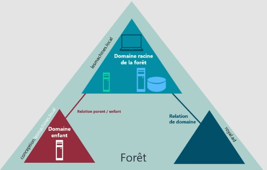

## Le domaine Active Directory et ses composantes

L’AD est un ensemble d’ordinateurs en réseau qui partagent une base de données commune. Il est administré comme un ensemble (règles et procédures communes).

Le contrôleur de domaine est le serveur qui assure la gestion du domaine. Il gère les tâches d’hébergement et de gestion de la base AD ainsi que l’authentification.

Site active directory : Composante logique du domine afin d’optimiser la replication, l’accès aux ressources. Il est composé d’un ou plusieurs sous réseaux TCP/IP

Avant de promouvoir un serveur en contrôleur de domaine, ces prérequis doivent être respectés :

### 🧩 Les composants de domaine : Rôles FSMO (Flexible Single Master Operations)

| 🌲 **Niveau** | 🎭 **Rôle**                        | 📝 **Description**                                                                                   |
|---------------|------------------------------------|-------------------------------------------------------------------------------------------------------|
| **Forêt**     | **Maître de nom de domaine**       | Contacté :<br>• Lors de l’ajout ou suppression d’un domaine<br>• ⚠️ En cas de **renommage** de domaine |
|               | **Maître de schéma**               | Peut modifier le schéma de l’AD (décrit les objets)<br>Les autres contrôleurs de domaine accèdent en lecture |
| **Domaine**   | **Maître RID**                     | Alloue les blocs d’**Identificateurs Relatifs (RID)** aux autres CD, pour générer les **SID**        |
|               | **Maître d’infrastructure**        | Gère les objets référencés entre **domaines différents** de la forêt                                 |
|               | **Maître émulateur PDC**           | - Gère les **mots de passe**<br>- Gère les **GPO**<br>- **Synchronise les horloges**<br>- Joue le rôle de **contrôleur principal** dans les anciens domaines |


### ✅ Prérequis pour l’ajout d’un contrôleur de domaine (DC)
| 🧩 Prérequis                             | 📝 Description                                                                 |
|-----------------------------------------|--------------------------------------------------------------------------------|
| **Nom d’hôte du poste**                 | Le nom d’hôte et le suffixe DNS doivent être correctement définis.            |
| **Configuration réseau et adressage IP**| Ces paramètres doivent être opérationnels.                                    |
| **Composants Windows**                  | Les composants relatifs aux services **ADDS** doivent être installés.         |
| **Prise en compte de l’existant**       | Analyser l’infrastructure existante et déterminer les points essentiels.      |
| **Préparation de l’AD**                 | La forêt ou le domaine peut être préparé lors de l’ajout d’un DC.             |


## Mettre en place un AD

💻 Graphiquement, aller dans : Gérer / Ajouter un rôle / AD DS – Terminer la configuration  

📜En powershell via la commande : 
```powershell
Install-WindowsFeature -Name AD-Domain-Services -IncludeManagementTools
```

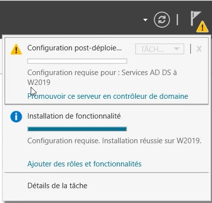  


Lors du retour sur le dashboard, **une notification nous indique de promouvoir le serveur en contrôleur de domaine**.

💻 Graphiquement
1. Ajouter une nouvelle forêt – Donner un domaine racine
2. Choisir le niveau de la forêt
3. Choisir le mot de passe DSRM (en cas de crash de l’AD)
4. Indiquer le domaine NetBIOS (laisse par defaut)
5. Terminer la configuration.
6. Redémarrer

📜En powershell via la commande : 
```powershell 
Install-ADDSForest `
  -DomainName "domaine.local" `         # 	Nom FQDN du domaine (ex : domaine.local)
  -DomainNetbiosName "DOMAINE" `        #	Nom court du domaine (utilisé pour compatibilité et connexion réseau)
  -SafeModeAdministratorPassword (Read-Host -AsSecureString "Mot de passe DSRM") ` # Mot de passe du mode DSRM (récupération en cas de panne AD
  -InstallDns:$true `   # Installe aussi le rôle DNS (souvent nécessaire avec AD)
  -Force                # Évite les confirmations interactives

  ```

Apres le redémarrage, les infos visibles sur les users, groups, domain controller seront dans « Utilisateurs et ordinateurs active Directory »

**Vérifier la regle de pare-feu - Partage de fichiers et d’imprimantes (Demande d’écho - Trafic entrant ICMPv4) pour les ping.**

## Ajouter un ordinateur / serveur au domaine AD

Après avoir installé le contrôleur de domaine, entrer dans les ordinateurs et serveurs (future membre de l'AD)   
Puis changer le nom de l’ordinateur pour rejoindre le domaine :
Indiquer un Nom de user en domain\***** et le mot de passe correspondant (admin du CD)

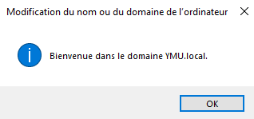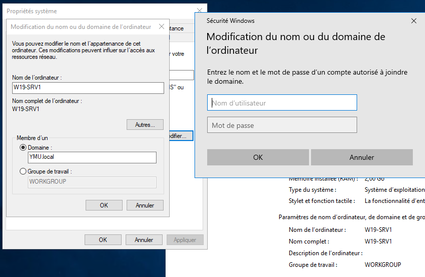


ou 📜En powershell via la commande :
```powershell

Add-Computer `
  -DomainName "tondomaine.local" `
  -Credential (Get-Credential) `
  -Restart
  ```


## Les bases de gestion d’un domaine

### 📚 Objets de l’annuaire et outils de gestion

Dans un contexte de domaine AD, les tâches courantes de gestion sont liées à l’administration des **principaux objets de l’annuaire**.

#### 🔐 Entités de sécurité

- Utilisateur
- Ordinateur
- Groupe
#### 📦 Conteneurs

- Unité d’organisation
- Conteneur système  

Les utilisateurs :
Il est utile de faire des modèles d’utilisateurs génériques avec :
- Un nom clair
- Le plus grand nombre de caractéristique standard
- Compte inactif

Il faudra alors dupliquer ce modèle pour créer un nouveau user.

 ##### 📦 Conteneurs système par défaut dans un domaine Active Directory

| 🏷️ Nom de l’objet | 📝 Fonction                                                                                      |
|-------------------|--------------------------------------------------------------------------------------------------|
| **Builtin**       | Éléments (utilisateurs et groupes locaux) présents dans la base SAM des CD **avant leur promotion**. Une fois promus, ils sont déplacés dans ce conteneur. |
| **Computers**     | Emplacement de stockage **par défaut des comptes ordinateurs**.                                 |
| **System**        | Emplacement de stockage des éléments nécessaires au fonctionnement de **l’AD** et composants associés. |
| **Users**         | Emplacement des groupes et **utilisateurs par défaut** dans un domaine AD.                      |


## Les groupes dans Active Directory

Un groupe est un ensemble d'utilisateurs, d'ordinateurs ou d'autres groupes qui partagent les mêmes permissions ou droits d'accès. Il existe principalement deux types de groupes en AD :  
- Groupes de sécurité : utilisés pour gérer les autorisations d'accès aux ressources (ex: un dossier partagé).
- Groupes de distribution : utilisés pour envoyer des e-mails collectifs (ex: une liste de diffusion).  

Dans un contexte multi-domaines, il y a des niveaux de portée qui définissent comment un groupe peut être utilisé.

### 📌 Groupe global (Global Group - GG)
Contient : uniquement des utilisateurs ou groupes du même domaine.  
Utilisation : utilisé pour organiser les utilisateurs en fonction de leur rôle (ex: "Comptabilité", "IT", "RH").  
Peut être ajouté dans : des groupes de domaine locaux et des groupes universels.  
✅ Exemple : Un groupe "GG_Comptabilité" contient tous les comptables de l’entreprise.

### 📌 Groupe de domaine local (Domain Local Group - DLG)
Contient : des utilisateurs, des groupes globaux, universels de n'importe quel domaine.  
Utilisation : utilisé pour accorder des permissions sur une ressource spécifique (ex: accès à un dossier partagé).  
Peut être ajouté dans : Rien d’autre, il est utilisé uniquement dans son domaine.  
✅ Exemple : Un groupe "DLG_Accès_Compta" permet l'accès à un dossier partagé de comptabilité.  

### Comment ça s'articule ? (Principe AGDLP)
L’organisation des groupes suit souvent la règle AGDLP :
- A (Accounts) : Les utilisateurs sont ajoutés aux
- G (Groupes Globaux) : Regroupent les utilisateurs selon leur fonction.
- DL (Domain Local Groups) : Ont les permissions sur les ressources.
- P (Permissions) : Les groupes DL reçoivent les permissions d’accès.  

✅ Exemple concret :  
Les utilisateurs "Jean" et "Paul" sont dans "GG_Comptabilité" (groupe global).  
"GG_Comptabilité" est ajouté dans "DL_Accès_Compta" (groupe de domaine local).  
"DL_Accès_Compta" reçoit les permissions sur le dossier partagé "Comptabilité".  

Les unités d’organisation OU / UO = Dossier avec des objets à l’intérieur
> ⚠️ **Il n’est pas conseillé de conserver les comptes ordinateurs du domaine dans le conteneur `Computers`.**  
> Il en va de même pour les comptes utilisateurs dans le conteneur `Users`.

### Importation de masse
Pour l'importation d'un grand nombre d'utilisateur et afin de s'assurer de la fiabilité de l'import, nous utiliserons :

1️⃣ Préparer un fichier CSV  
Crée un fichier utilisateurs.csv avec le contenu suivant :  
``GivenName,Surname,Name,SamAccountName,UserPrincipalName,OU
Jean,Durand,jdurand,jdurand,jdurand@domaine.local,"OU=Utilisateurs,DC=domaine,DC=local"
Marie,Martin,mmartin,mmartin,mmartin@domaine.local,"OU=Utilisateurs,DC=domaine,DC=local"``

2️⃣ Script PowerShell d'importation 📜
```powershell
Import-Csv -Path "C:\Scripts\utilisateurs.csv" | ForEach-Object {
    New-ADUser `
        -GivenName $_.GivenName `
        -Surname $_.Surname `
        -Name $_.Name `
        -SamAccountName $_.SamAccountName `
        -UserPrincipalName $_.UserPrincipalName `
        -Path $_.OU `
        -AccountPassword (ConvertTo-SecureString "Motdepasse@123" -AsPlainText -Force) `
        -Enabled $true
}
```

## Les autorisations NTFS

Elles permettent de définir des privilèges d’accès.   
Des autorisations de base et avancées.  
Les permissions NTFS sont soumises à héritage.  


### ✅ Autorisations **de base**

| 🟦 Lecture | 🟦 Liste de contenu | 🟦 Lecture + exécution | 🟦 Écriture | 🟦 Modification | 🟦 Contrôle total |
|-----------|--------------------|------------------------|------------|----------------|------------------|

---

### 🔒 Autorisations **avancées**

| Appropriation | Création de fichiers | Création de dossiers | Écriture des attributs étendus |
|---------------|-----------------------|-----------------------|-------------------------------|
| Lecture des attributs étendus | Modifier les autorisations | Suppression | Suppression de sous-dossiers et fichiers |


## Partage de fichiers

Le partage vient en complément des autorisations NTFS.
Comme pour les autorisations NTFS, le refus explicite est prioritaire sur le reste.

Lorsqu’un user se connecte sur un dossier partagé, il est soumis :
1. Aux autorisations de partage en premier
2. Aux autorisations NTFS en second
3. Les privilèges les plus restrictifs prévalent

**Il est indispensable de publier le partage dans l’AD afin de pouvoir le retrouver facilement**

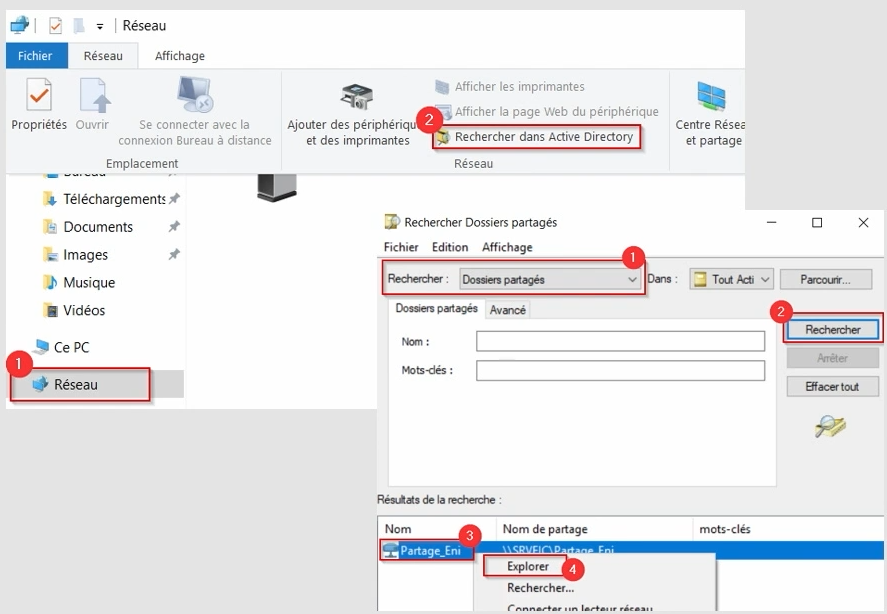


## Stratégie d’imbrication des groupes

Afin de gérer efficacement l’accès aux ressources partagés, Microsoft préconise l’imbrication des groupes globaux et locaux


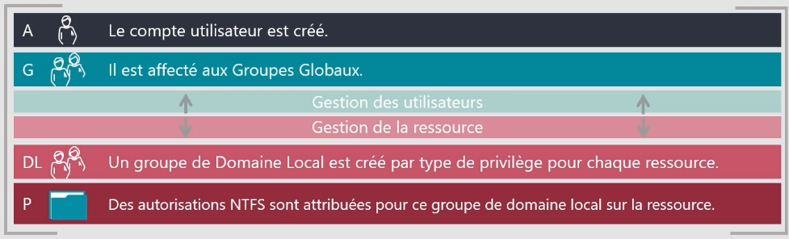


Les groupes locaux servent à définir les autorisations.  
Exemple :
- Le groupe GG_marketing est membre du groupe partage_marketing_CT
- Le groupe partage_marketing_CT a le contrôle total sur le dossier de partage
- Les membres du groupe GG_marketing auront l’accès total au dossier partagé

Tous se fait via le partage avancé des dossiers.

## Le service d’impression

Nécessite le rôle de serveur d’impression.
Permet l’accès à l’outil Outil d’administration/Gestion de l’impression

Pour ajouter une imprimante :
- Définir le port TCP/IP
- Ajouter l’imprimante et lui attribuer le port
- Clic droit sur l’imprimante et ajouter à l’annuaire pour l’ajouter à l’AD.

# Les stratégies de groupes – GPO

Plusieurs types de stratégie :
- Local (hors domaine, poste par poste)
- Groupe
- Domaine : En cas de conflits, elle l’emporte sur la stratégie locale

## Application d’une stratégie GPO

Elle se gère via les consoles **MMC**. Lors de la mise en place d’une GPO :

- **Par défaut toutes les 90 min** à plus ou moins 30 min près
- **Pour les contrôleurs de domaine**, toutes les **5 min**
- Possibilité de **passage en mode manuel**
  - Via la commande : `gpupdate` sur le poste visé par les stratégies

---

## Deux stratégies sont configurées par défaut :

### 🔷 Default Domain Policy (DDP)
- Liée à la **racine du domaine**
- Définit les paramètres de sécurité pour les **utilisateurs du domaine**

### 🔴 Default Domain Controller Policy
- Liée à l’**UO Domain Controllers**
- Définit les paramètres de sécurité pour les **contrôleurs de domaine**


## Le ciblage des stratégies

🧩 Application d’une stratégie de groupe (GPO)

### 🧱 Objet de stratégie créé

> Le ciblage permet de définir le ou les objets soumis à cette règle.

---

### 🔗 La liaison d’une stratégie se fait via les objets suivants :

- 🌐 Un site **Active Directory**
- 🏢 Un **domaine**
- 🗂️ Une **Unité d’Organisation** (OU)

---

### 📥 Une fois liée, la stratégie s’applique sur :

- 🖥️ Les objets **ordinateurs** → pour les paramètres **ordinateur**
- 👤 Les objets **utilisateurs** → pour les paramètres **utilisateur**

---
⚠️ Attention

> 🛑 **Les GPO ne s’appliquent pas aux membres de groupes.**  
> Une stratégie ne peut être appliquée **qu’aux objets présents dans le conteneur auquel elle est liée** (ex. : utilisateurs ou ordinateurs d’une OU).  
> 👉 Les **groupes** ne peuvent pas recevoir de GPO directement.


## Console « Gestion de stratégie de groupe »
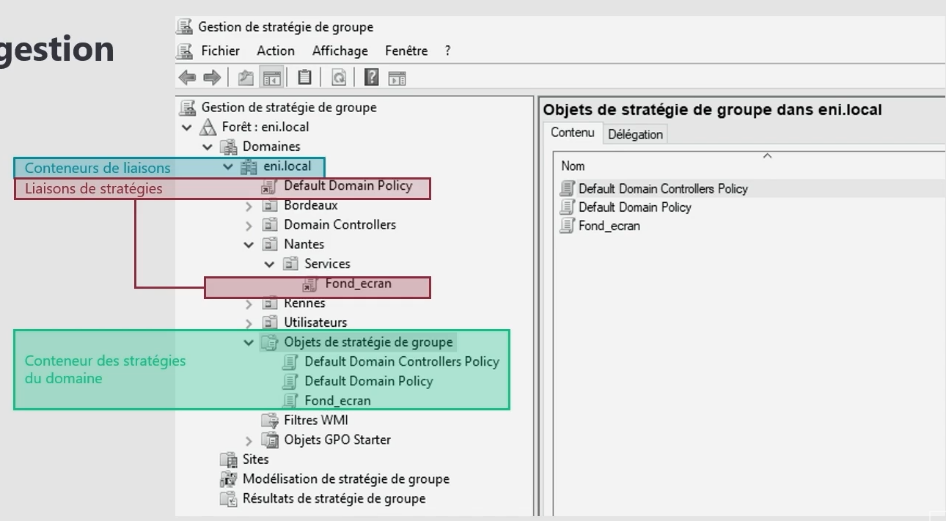

🔁 Priorités et héritage des GPO

 Héritage
> 🧬 Les stratégies sont **héritées du parent vers l’enfant**.  
> ⏳ Les stratégies héritées sont **appliquées avant** celles du **conteneur courant**.
---
🔢 Priorité d’application
> 🔝 Les stratégies dont le **numéro d’ordre est le plus élevé** sont appliquées en **premier** *(au sein d’un même conteneur)*.  
> ✅ Les stratégies **marquées "Appliquées"** deviennent **prioritaires**, même si elles sont héritées.

Pour résumer :
- Les stratégies de groupe fonctionnent sur des UO (tous les objets hors groupe)
- Les stratégies sont héritables P->E, et sont appliquées avant celles du conteneur courant.
- Les stratégies appliquées sont prioritaires sur les héritées.
- L’ordre des stratégies est important dans un même conteneur
- Il y a possibilité de bloquer l’héritage.

Pour forcer la mise en place de la stratégie (et bypasser les 90 minutes classiques), utiliser la commande cmd ``gpupdate /force``

## Le Principe de redirection
Les dossiers du **profil utilisateur** sont stockés sur un **emplacement réseau**.

### 📁 Dossiers concernés :
- Documents
- Bureau
- Menu démarrer
- Contacts

➡️ Ces dossiers sont redirigés vers un **serveur de fichiers**

#### 📌 Paramètres du dossier partagé :
- **Partage** : contrôle total pour les utilisateurs redirigés
- **Permissions NTFS** : liste du dossier + création et obtention de dossiers dans ce dossier seulement

---

## Paramètres & Options de redirection

| **Paramètres** | **Options** |
|----------------|-------------|
| **De base** : <br>Les dossiers redirigés de l’ensemble des utilisateurs seront stockés dans un **même emplacement réseau** | - Redirection vers le répertoire d’accueil de l’utilisateur <br> ➤ *Les nouveaux utilisateurs ne bénéficieront pas de redirection de dossiers* <br> - Créer un dossier pour chaque utilisateur sous le chemin d’accès racine <br> ➤ *Chaque utilisateur dispose de son propre sous-dossier* |
| **Avancé** : <br>En fonction de leur **appartenance à des groupes**, les dossiers des utilisateurs seront stockés dans des **emplacements réseau différents** | - Rediriger vers l’emplacement suivant <br> ➤ *Les dossiers redirigés des utilisateurs se trouveront dans ce même sous-dossier* <br> - Redirection vers l’emplacement du profil local <br> ➤ *Arrêt de la redirection* |

# Le routage

**Le routage permet la communication entre plusieurs réseaux logiques**.  
Il peut être statique ou dynamique.  

Une route est constituée de :  
- Adresse réseau de destination
- Masque de sous réseau
- Adresse de passerelle


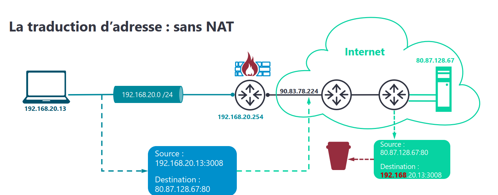
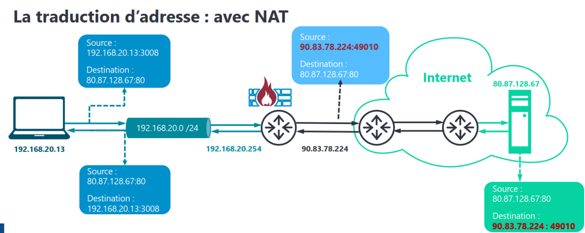

NAT (network adress translation)


# Le DHCP (Dynamic Host Configuration Protocol)

## Utilité d’un DHCP
Le DHCP permet de configurer un certain nom d’information pour les clients avec adresse dynamique donc il s’occupe d’attribuer une adresse tel que :  
✅ Adresse IP : assignée dynamiquement à partir d’une plage d’adresses définie.  
✅ Masque de sous-réseau : permet de définir la taille du réseau.  
✅ Passerelle par défaut (Gateway) : l’adresse du routeur permettant la communication hors du réseau local.  
✅ Serveurs DNS : pour la résolution des noms de domaine en adresses IP.  
✅ Durée du bail (Lease Time) : définit la durée pendant laquelle l’IP est attribuée avant d’être renouvelée.  
✅ Serveur WINS (Windows Internet Name Service) : utilisé dans les environnements Windows pour la résolution de noms NetBIOS.  
✅ Autres options spécifiques : comme les informations sur le serveur NTP (Network Time Protocol) ou encore le serveur TFTP pour le boot PXE.  

Le bail DHCP (lease) correspond à la durée pendant laquelle une adresse IP est attribuée dynamiquement à un client.  

## Processus DORA (Discover, Offer, Request, Ack)
Comment un PC fait il pour se connecter au bon serveur DHCP ?  
- Le PC arrive sur le réseau et fait une requête ``DHCP discover`` dans le domaine de diffusion en broadcast (255.255.255.255)  
- Le serveur DHCP répond avec une requête ``DHCP offer `` 
- Le PC accepte avec une requête ``DHCP REQUEST  ``
- Le DHCP envoi les paramètres réseaux avec une requête ``DHCP ACK  ``
- 
Le bail ayant une durée, le client demandera un renouvellement de bail automatiquement à 50% et 7/8eme de la durée de celui-ci    
En cas de plusieurs DHCP offer (si plusieurs serveur DHCP), le client prend toujours le plus rapide (avec le moins de latence)    

Pour mettre fin à un bail (Release), il faut, via cmd taper la commande ``ipconfig /release `` 
``ipconfig /renew`` pour  déclencher DORA de nouveau

## L’étendue (ou scope d’un serveur DHCP)
L’étendue est caractérisée par :
- Une plage d’adresse IP Utilisable
- Un nom (ex : LAN_SERVEUR)
- Une durée de bail
- Des exclusions d’adresse IP

La réservation permet, avec l’adresse MAC d’un client, de lui attribuer toujours la même IP. Il est lié à un conteneur parent (ex : Etendue LAN_SERVEUR)


## Configuration d’un serveur DHCP
💻Graphiquement : 
- Gérer / Ajouter des rôles / Serveur DHCP (il faut que le serveur hébergeant le serveur DHCP ai une adresse IP statique).
- Cliquer sur le flag pour terminer la configuration du serveur DHCP.
- Nouvel outil d’administration « DHCP ».

- Pour ajouter une étendue  Clic droit / Ajouter une étendue
- Configurer les options puis activer l’étendue  Clic droit / activer

En Powershell📜
```powershell
# Installer le rôle DHCP
Install-WindowsFeature -Name DHCP -IncludeManagementTools

# Valider la configuration post-installation
Install-DhcpServerInDC -DnsName "nomduserveur.domaine.local" -IPAddress 192.168.1.10

#Créer une étendue DHCP
Add-DhcpServerv4Scope -Name "Etendue-LAN" -StartRange 192.168.1.100 -EndRange 192.168.1.200 -SubnetMask 255.255.255.0 -State Active
```
## Les options de configuration

Elles complètent la configuration IP. Quelques exemples :
- Définir une gateway
- Définir un serveur DNS
- Définir un suffixe DNS…

Les options peuvent être configurée pour :
- Le serveur
- Une étendue
- Une réservation

Pour les configurer 💻 Graphiquement :  Clic droit / Définir une option

En powershell 📜

```powershell
# Configuration des options d'étendues 
Set-DhcpServerv4OptionValue -ScopeId 192.168.1.0 -Router 192.168.1.1
Set-DhcpServerv4OptionValue -ScopeId 192.168.1.0 -DnsServer 192.168.1.1 -DnsDomain "domaine.local"
Set-DhcpServerv4Scope -ScopeId 192.168.1.0 -State Active
```

## Agent relais DHCP

Il est utile lors de plusieurs domaines de diffusion pour un seul serveur DHCP.  
Il s’active sur Pfsense avec DHCP relay.

## Le DHCP dans un domaine

En premier lieu, dans un domaine, le serveur DHCP doit être autorisé à démarrer.  
Les opérations de gestion de la base DHCP :  
- Stocker les données dans une base
- Sauvegarder cette base de manière Synchrone ou Asynchrone

Le fractionnement d’étendue = Fractionnement automatisé d’une étendue sur deux serveurs.

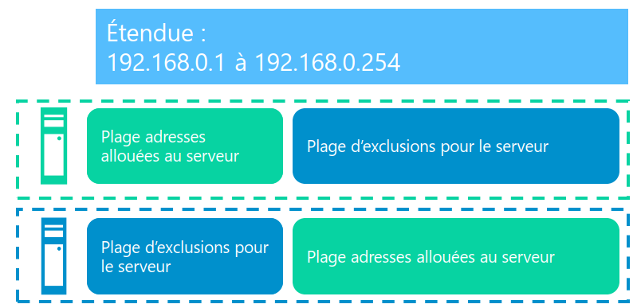 

Répartition de la charge :  
- Si plusieurs serveurs DHCP sont utilisés dans un réseau, la fragmentation d'étendue permet de répartir la charge entre eux. Par exemple, un serveur peut gérer la moitié des adresses disponibles et un autre serveur l'autre moitié.
- Redondance et tolérance aux pannes :  
En configurant des plages d'adresses IP sur plusieurs serveurs DHCP, on améliore la disponibilité du service en cas de panne d'un serveur.
- Segmentation des adresses pour différents usages :  
On peut attribuer des plages spécifiques à différents types d'appareils (ex. : PC, imprimantes, téléphones IP) ou à différents sous-réseaux.
- Gestion optimisée des adresses :  
Si un réseau évolue, la fragmentation d'étendue permet d'ajouter des nouvelles plages d'adresses sans perturber la distribution actuelle.
- Éviter les conflits d'adresses :  
Lorsqu’un réseau contient plusieurs serveurs DHCP, il est important que leurs étendues ne se chevauchent pas pour éviter d’attribuer la même adresse IP à plusieurs appareils.


# Le service DNS

Le DNS (Domain Name System) est un système qui traduit les noms de domaine compréhensibles par les humains (comme exemple.com) en adresses IP compréhensibles par les machines (comme 192.168.1.1). Il agit comme un annuaire téléphonique d’Internet.  

## Mécanismes de résolution DNS

| **Mécanismes**        | **Utilité** |
|------------------------|-------------|
| **Le cache DNS**       | - Contient des correspondances entre noms d’hôtes déjà résolus et leurs adresses IP.  <br> - Conserve aussi les réponses négatives aux requêtes du client. <br> - Se gère avec la commande **`ipconfig`**. |
| **Le service DNS**     | - Les clients DNS interrogent leur(s) serveur(s) DNS pour leurs requêtes de résolution. |
| **Le fichier hosts**   | - Les modifications (ajout/suppression d’entrées) dans ce fichier sont reportées dans le cache DNS **dès l’enregistrement** du fichier. |


Le fichier hosts est un fichier système qui associe manuellement des noms de domaine à des adresses IP, sans passer par un serveur DNS.   
Il permet de rediriger des sites web localement sur un ordinateur.  
Ses informations sont donc prioritaires par rapport à l’interrogation du service DNS.  

📂 Emplacement du fichier hosts :
Windows : ``C:\Windows\System32\drivers\etc\hosts``  
Linux / macOS : ``/etc/hosts``

La syntaxe de ce fichier est la suivante :
```
Adresse_IP 	Nom
8.8.8.8		google.com
172.17.0.0	srv01, srv01.monentreprise.local
```

## Nom d’hôte et de domaine

**Nom d’hôte (Hostname)**  
Le nom d’hôte est le nom unique attribué à un ordinateur ou un périphérique sur un réseau. Il permet d’identifier une machine localement.

Le nom de domaine est une adresse lisible par l’homme qui identifie un site web sur Internet. Il est géré par le DNS (Domain Name System) et suit une hiérarchie.

Nom du PC = Nom netbios.  
Nom du PC dans un domaine = netbios dans un domaine = Name_netbios.domain.local = FQDN (fully Qualified Domain Name).

Le DNS peut résoudre des FQDN.


Pour être résolvable, tout hôte doit être identifiable via un nom pleinement qualifié unique à l’échelle mondiale.  
On peut utiliser des espaces de nom :  
- Privé : Pour des noms interne uniquement – Déconseillé de choisir des noms référencés sur internet
- Public : Référencé sur internet

## Hiérarchisation des espaces de nom
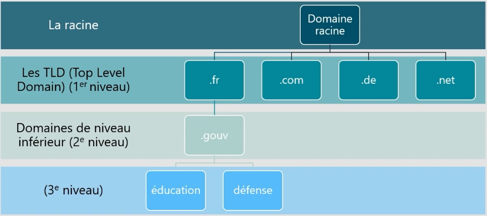


Dans le DNS, on lit les noms de domaine de droite à gauche car chaque niveau délègue au suivant.
📌 Décomposition de www.france.education.gouv.fr
L'adresse complète est www.france.education.gouv.fr. (avec le point final représentant la racine, souvent omis).

La résolution des DN externe à l’entreprise nécessite un DNS résolveur
La mise en place de nommage interne (AD par ex) nécessite un serveur DNS hébergeur.
L’hébergeur et résolveur peuvent être assurés par un serveur ou deux distincts.

## Le rôle du serveur DNS résolveur

**Fonctionnement du DNS avec un résolveur**  

Lorsqu'un utilisateur tape www.exemple.com dans son navigateur, voici ce qui se passe :  
- L’ ordinateur interroge le DNS résolveur
  - 📌 Si l’adresse IP est déjà en cache (mémorisée), le résolveur répond directement.
  - 📌 Sinon, il suit le processus suivant :
- Le résolveur interroge les serveurs DNS
  - 🔹 Serveur racine (.) → Donne l'adresse des serveurs TLD .com
  - 🔹 Serveur TLD (.com) → Donne l'adresse du serveur de exemple.com
  - 🔹 Serveur DNS de exemple.com → Donne l'adresse IP finale
- Le résolveur renvoie l’IP à l’ordinateur
  - 📌 Le navigateur peut maintenant se connecter à l'adresse IP et afficher la page web.
  - 📌 L'IP est mise en cache temporairement pour accélérer les prochaines requêtes.


Deux types de requêtes peuvent être adressés à un serveur DNS :

1. Requête Récursive (Full Service DNS) ✅  
📌 Le résolveur DNS fait tout le travail pour le client.  

🔄 Fonctionnement :
L'ordinateur de l'utilisateur demande l'adresse IP de www.exemple.com à un résolveur récursif.  
Le résolveur interroge les serveurs DNS hiérarchiques (racine → TLD → domaine final).  
Une fois l'IP trouvée, le résolveur la retourne à l'utilisateur.  

🌟 Avantages :  
✅ Simple et rapide pour l'utilisateur → Pas besoin de gérer la résolution DNS.  
✅ Réduction du trafic réseau → Seule une requête est envoyée par le client.  
✅ Utilisé par les FAI et DNS publics (Google DNS, Cloudflare, etc.).  

⚠️ Inconvénients :  
❌ Charge élevée pour le résolveur → Il doit traiter toutes les requêtes.  
❌ Vulnérable aux attaques DNS (ex: DNS poisoning).  


2. Requête Itérative (Step by Step) 🔄  

📌 Le client (ou résolveur) interroge chaque serveur DNS séparément, étape par étape.

  🔄 Fonctionnement :
L'ordinateur de l'utilisateur demande l'IP de www.exemple.com à un serveur DNS.  
Si ce serveur ne sait pas, il ne cherche pas lui-même la réponse, mais dit :  
"Je ne sais pas, mais demande aux serveurs racine (.)"  
L'ordinateur interroge alors un serveur racine, qui lui dit :  
"Demande aux serveurs TLD (.com)."  
L'ordinateur interroge le serveur TLD, qui lui dit où trouver le serveur de exemple.com.  
Finalement, le serveur de exemple.com répond avec l’IP.  

🌟 Avantages :  
✅ Répartition de la charge → Chaque serveur ne fait qu’une partie du travail.  
✅ Moins vulnérable aux attaques DNS → Chaque serveur répond de manière indépendante.  

⚠️ Inconvénients :  
❌ Plus long pour l’utilisateur → Chaque étape prend du temps.  
❌ Plus de trafic réseau → Chaque serveur doit être interrogé séparément.  

👉 En pratique :  
Ton ordinateur utilise un résolveur récursif (ex: Google DNS 8.8.8.8).  
Ce résolveur effectue ensuite des requêtes itératives vers les serveurs racine, TLD, etc.  

## La Redirection

Lorsqu'on met en place un DNS externe, la redirection non conditionnelle DNS permet d’envoyer les requêtes non résolues par le DNS interne vers un serveur DNS externe (comme Google DNS, Cloudflare, ou celui d’un FAI).  

Un redirecteur conditionnel (Conditional Forwarder) permet à un serveur DNS d'envoyer des requêtes vers un DNS spécifique en fonction du domaine demandé.  
💡 Contrairement à une redirection classique, qui envoie toutes les requêtes non résolues vers un DNS externe, le redirecteur conditionnel applique une règle ciblée.

🖥️ Exemple d’un réseau d’entreprise  
Imaginons une entreprise avec :  
🌐 Un domaine interne : intranet.entreprise.local  
📡 Un partenaire externe : partenaire.com  
🌍 Internet (public)  

Tous les résultats des requêtes DNS sont enregistrés dans un cache et la durée de conservation est propre à chaque enregistrement (Time To Live).  
Attention, les réponses négatives sont aussi enregistrées :  
Par exemple : Impossible de joindre google.com  
Il ne sera pas possible de résoudre google.com durant la durée de vie de l’enregistrement de la requête  
Il faudra alors purger le cache ou attendre.  

*NB : La RFC 2308 recommande un TTL maximum de 900 secondes (15 minutes) pour les réponses négatives.*  


## Installation d’un serveur DNS
Graphiquement 🖥️ : 
- Ajouter un rôle / serveur DNS
- Nouvel outil d’administration DNS.
- Commande cmd pour tester la résolution : ``nslookup NOMDUSITE``

Pour spécifier un redirecteur (si requête non résolue), clic droit sur DNS/Propriété/Redirecteur

Afficher le cache DNS : 	``ipconfig /displaydns``
Purger le cache DNS : 	``ipconfig /flushdns``

En powershell 📜
```powershell
# Ajouter un role DNS 
Install-WindowsFeature -Name DNS -IncludeManagementTools

# Commande DNS 
Get-Command -Module DnsServer

# Ajouter un redirecteur 
Add-DnsServerForwarder -IPAddress "8.8.8.8"

# Voir les redirecteurs
Get-DnsServerForwarder

# Voir le DNS local
Get-DnsClientCache

# Vider le DNS local
Clear-DnsClientCache

```
## Le DNS hebergeur

Il gère un ou plusieurs espaces de nom.  
Les zones contiennent un ensemble d’enregistrement d’un espace de nom.  
Plusieurs types de zones :  
- Directe : Permet de résoudre un nom en adresse IP (CLI-00  192.168.0.6)
- Inverse : Permet de résoudre les adresses IP en nom (192.168.0.6  CLI-00)

Il existe également des serveurs maitres et esclaves : 

📊 Serveur maître vs Serveur esclave (DNS)

| **Caractéristiques**         | **Serveur maître**       | **Serveur esclave**     |
|-----------------------------|--------------------------|--------------------------|
| **Type de zone hébergée**    | Zone principale           | Zone secondaire          |
| **Autorisation d’accès**     | Lecture / écriture        | Lecture                  |
| **Fait autorité pour la zone** | Oui                     | Oui                      |


Le contenu d’une zone : 
- Un SOA (Start Of Authority) : Nom FQDN du serveur DNS disposant de la zone en écriture
- Serveur Maitre
- Un ou des NS (Name Server) : serveurs faisant autorité pour la zone
- Serveur maitre ou esclave

Pour une zone directe : 						
| **Type d’enregistrement** | **Contenu**                                                                 |
|---------------------------|------------------------------------------------------------------------------|
| **SOA**                   | Nom FQDN du serveur DNS disposant de la zone en **écriture**                |
| **NS**                    | Serveur(s) **faisant autorité** pour la zone                                 |
| **A**                     | Hôte IPv4                                                                    |
| **AAAA**                  | Hôte IPv6                                                                    |
| **CNAME**                 | Alias (nom canonique)                                                        |
| **MX**                    | Serveur de messagerie                                                        |
| **SRV**                   | Services (utilisé pour localiser des services spécifiques dans un domaine)   |

Pour une zone inverse : 
| **Type d’enregistrement** | **Contenu**                                                                 |
|---------------------------|------------------------------------------------------------------------------|
| **SOA**                   | Nom FQDN du serveur DNS disposant de la zone en **écriture**                |
| **NS**                    | Serveur(s) **faisant autorité** pour la zone                                 |
| **PTR**                   | Pointeur (utilisé pour la résolution **inverse** d’adresse IP → nom DNS)     |


## Les mises à jour et enregistrement dynamique
Utile pour les postes clients adressé par DHCP

Le transfert de zone :
1. Le serveur secondaire interroge le serveur maitre
2. Comparaison avec le serveur principale
3. Transfert et mise à jour de zone.


Pour mettre à jour automatique le serveur DNS et incrémenter les nouveaux postes de manière graphique 🖥️ : 
- Clic droit/propriété / Mise à jour dynamique/ Non sécurisé et sécurisé
- Lorsqu’un hôte viendra scanner, il sera intégré
- Pour initier un transfert de zone, clic droit sur la zone/propriété/transfert de zone sur le serveur DNS maitre
- Sur l’esclave, créer une zone secondaire / indiquer le serveur maitre
- Clic droit sur la zone créé et transfert de la nouvelle copie à partir du maitre

En powershell 📜
```powershell
# Autoriser la mise à jour dynamique 
Set-DnsServerPrimaryZone -Name "domaine.local" -DynamicUpdate NonsecureAndSecure

# Activer le transfert de zone sur le serveur DNS maître
Set-DnsServerZoneTransfer -Name "domaine.local" -AllowZoneTransfer $true -SecondaryServers "192.168.1.20"

# Créer une zone secondaire sur l’esclave
Add-DnsServerSecondaryZone -Name "domaine.local" -ZoneFile "domaine.local.dns" -MasterServers "192.168.1.10" -ComputerName "NomDuServeurEsclave"

# Forcer le transfert de zone manuellement (depuis l’esclave)
Invoke-DnsServerZoneTransfer -Name "domaine.local" -ComputerName "NomDuServeurEsclave"
```

## Les sous domaines et délégation

Pour créer un sous-domaine, il faut que le sous-domaine possède un serveur dns enfant.  
mazone.local  DNS parent  
exemple.mazone.local  DNS enfant  

Pour créer une délégation de zone 🖥️ : 
-  clic droit sur la zone / nouvelle délégation / entrer le domaine délégué puis ajoutez l’ip du serveur DNS enfant.

En powershell 📜
```powershell
Add-DnsServerZoneDelegation -Name "sousdomaine" -ZoneName "domaine.local" -NameServer "dns.sousdomaine.domaine.local" -IPAddress "192.168.1.100"

```