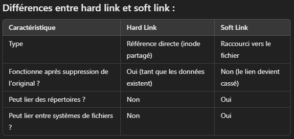

# Commandes principales

## Les commandes de base 

``ip a`` : Donne l’adresse IP de la machine

``who [option]``: Affiche les utilisateurs actuellement connectés au système avec des informations telles que le terminal, la date et l'heure de connexion.

**Options courantes :**
- ``-a`` : Affiche toutes les informations disponibles (utilisateurs, sessions, etc.).
- ``-b`` : Affiche l'heure du dernier démarrage du système.
- ``-u`` : Affiche l'heure de connexion et d'autres détails.
- ``-H`` : Affiche des en-têtes de colonnes pour une meilleure lisibilité.
- ``-q`` : Affiche uniquement les noms d'utilisateurs connectés.
- ``-T`` : Affiche des informations supplémentaires sur le type de terminal

``date [option]`` : Affiche ou définit la date et l'heure système du système Linux.
Options courantes :
- ``+FORMAT`` : Affiche la date et l'heure dans un format spécifique.
	- Directives de format courantes :
		- ``%a`` : Jour de la semaine en trois lettres (ex. : Mon, Tue).
		- ``%A`` : Jour de la semaine complet (ex. : Monday, Tuesday).
		- ``%b`` : Mois en trois lettres (ex. : Jan, Feb).
		- ``%B`` : Mois complet (ex. : January, February).
		- ``%d`` : Jour du mois (01 à 31).
		- ``%H`` : Heure au format 24h (00 à 23).
		- ``%I`` : Heure au format 12h (01 à 12).
		- ``%j`` : Jour de l'année (001 à 366).
		- ``%m`` : Mois (01 à 12).
		- ``%M`` : Minutes (00 à 59).
		- ``%p`` : AM ou PM.
		- ``%S`` : Secondes (00 à 59).
		- ``%U`` : Semaine de l'année (00 à 53, dimanche comme premier jour de la semaine).
		- ``%w`` : Jour de la semaine (0 à 6, où 0 est dimanche).
		- ``%Y`` : Année complète (ex. : 2025).
		- ``-u`` : Affiche l'heure en UTC (temps universel coordonné).

```bash
 date "+%A, %d %B %Y, %H:%M:%S" # Monday, 27 January 2025, 14:45:32
```

``cal`` : Affiche un calendrier sur le terminal, par mois ou par année.
Options courantes :
- ``-1`` : Affiche le calendrier d'un mois (par défaut).
- ``-3`` : Affiche le calendrier du mois courant, le mois précédent et le mois suivant.
- ``-y`` : Affiche le calendrier pour toute l'année.
- ``-m`` : Affiche le calendrier d'un mois spécifique. Par exemple, cal -m 5 pour mai.
- ``-A N`` : Affiche les N mois après le mois courant.
- ``-B N`` : Affiche les N mois avant le mois courant.
- ``-j`` : Affiche les jours de l'année au lieu des dates du mois (ex. : jour 1 = 1er janvier, etc.).

``cd [chemin]``: La commande cd (pour "change directory") permet de **naviguer entre les répertoires du système de fichiers.**
Options courantes :
- ``~`` : Représente le répertoire personnel de l'utilisateur actuel. Utilisé pour revenir rapidement au répertoire de base.
- ``..`` : Permet de remonter d'un niveau dans l'arborescence des répertoires.
- ``/`` : Utilisé pour aller directement à la racine du système de fichiers.

``cat`` :La commande cat (abréviation de "concatenate") est utilisée pour lire, afficher et fusionner le contenu de fichiers texte.
Options courantes :
- ``-n`` : Numérote toutes les lignes du fichier dans la sortie.
- ``-b ``: Numérote uniquement les lignes non vides.
- ``-s`` : Supprime les lignes blanches répétées dans la sortie.

*Exemple pour fusionner plusieurs fichiers en un seul*
```bash
cat fichier1.txt fichier2.txt > fichier3.txt
# cat : Affiche le contenu des fichiers 
# > redirige le résultat de la commande dans un fichier
```

``ls`` : La commande ls est utilisée pour lister les fichiers et répertoires dans un répertoire donné.
Options courantes :
- ``-l`` : Affiche les détails des fichiers (permissions, propriétaire, taille, date de modification, etc.).
- ``-a`` : Affiche tous les fichiers, y compris les fichiers cachés (ceux qui commencent par un .).
- ``-h`` : Affiche les tailles de fichiers dans un format lisible (Ko, Mo, etc.) lorsqu'il est utilisé avec -l.
- ``-R`` : Affiche récursivement les fichiers et sous-répertoires.
- ``-t`` : Trie les fichiers par date de modification, du plus récent au plus ancien.
- ``-S`` : Trie les fichiers par taille, du plus grand au plus petit.
- ``-1`` : Liste un fichier par ligne pour un affichage compact.
- ``-d`` : affiche uniquement les informations sur les répertoires spécifiés, sans lister leur contenu.

``mkdir`` : Permet de créer des répertoires (dossiers) dans le système de fichiers.
Options courantes :
- ``-p`` : Crée un répertoire parent et tous les sous-répertoires nécessaires (pas d'erreur si les répertoires existent déjà).
- ``-v ``: Affiche un message pour chaque répertoire créé.

``rmdir`` : Permet de supprimer **un répertoire vide**. Si le répertoire contient des fichiers ou sous-répertoires, la suppression échoue.
Options courantes :
- ``-p`` : Supprime un répertoire et, récursivement, ses parents s'ils sont vides.
- ``-v`` : Affiche un message pour chaque répertoire supprimé.

```bash
 rmdir mon_dossier # Suprimme mon_dossier
 rmdir -p parent/sous_dossier # Supprimer parents et sous_dossier
 # idem mkdir
```

``rm`` : La commande rm est utilisée pour supprimer des fichiers et/ou des répertoires dans le système Linux.
Options courantes :
- ``-f`` : Force la suppression sans demander de confirmation, même pour des fichiers protégés en écriture.
- ``-r ou -R`` : Supprime les répertoires et leur contenu de manière récursive (nécessaire pour les dossiers non vides).
- ``-i`` : Demande une confirmation avant de supprimer chaque fichier.
- ``-I`` : Demande confirmation avant de supprimer plusieurs fichiers ou un répertoire non vide.
- ``-v`` : Affiche les fichiers ou répertoires supprimés (mode "verbose").

<span style="font-style:italic; color:rgb(255, 0, 0)">Attention</span><span style="color:rgb(255, 0, 0)">, ne jamais utiliser les argument -r (récursive) et -f(force) ensemble car -fr ou -rf = forcer la suppression de tous les fichiers et dossier contenu dans le dossier choisit.</span>


``ln ``: Créer des liens symboliques ou physiques entre des fichiers ou répertoires
Options courantes :
- ``-s`` : Crée un lien symbolique (soft link).
- ``-v`` : Affiche les actions effectuées (mode verbose).
- ``-f`` : Force la création du lien en supprimant un lien existant au même emplacement.
- ``-i`` : Demande confirmation avant d'écraser un lien existant.
- ``-t`` : Indique le répertoire cible où le lien doit être créé.
- 



*Exemple pour créer un lien symbolique vers un répertoire :*
```bash
ln -s /chemin/vers/repertoire lien_vers_repertoire
```


``wc`` : La commande wc (word count) permet de compter le nombre de lignes, mots et caractères dans un fichier ou une entrée standard.
Options courantes :
- ``-l`` : Affiche le nombre de lignes.
- ``-w`` : Affiche le nombre de mots.
- ``-c`` : Affiche le nombre de caractères.
- ``-m`` : Affiche le nombre de caractères (en tenant compte de l'encodage multioctets).
- ``-L`` : Affiche la longueur de la ligne la plus longue.

Exemple :  
```bash
wc -l fichier.txt  # Affiche le nombre de ligne d’un fichier
```


## Compression / Décompression

``tar ``: La commande tar permet de créer, extraire et manipuler des archives de fichiers (souvent utilisées pour la sauvegarde).

Options courantes :
- ``-c`` : Crée une nouvelle archive.
- ``-x`` : Extrait le contenu d'une archive.
- ``-v`` : Affiche les fichiers traités (mode verbeux).
- ``-f`` : Spécifie le nom de l'archive.
- ``-z ``: Compresse ou décompresse l'archive avec gzip.
- ``-j`` : Compresse ou décompresse l'archive avec bzip2.
- ``-J`` : Compresse ou décompresse l'archive avec xz.
- ``-t`` : Affiche le contenu d'une archive sans l'extraire
- ``-r`` : Ajoute des fichiers à une archive non compressée.
- ``-u`` : Ajoute des fichiers à une archive compressée (gzip, bzip2, xz).

*Exemples :*
```bash
tar -cvf archive.tar dossier/    # Créer une archive sans compression
tar -czvf archive.tar dossier/   # Créér une archive avec compression
tar -rvf ‘fichier_a_ajouter.txt  # Ajouter un fichier à une archive non compressée
tar -xvf archive.tar             # Decompression de l'archive 
tar -tvf archive.tar             # Voir le contenu d'une archive sans extraire
```

## Gestion des processus en arrière-plan

``&`` : Lancer une commande en arrière plan
``jobs`` : Voir les commandes en arrières plan (``-l`` pour voir les PID)
Passer un processus en avant plan : ``bg PID``
Pour relancer un processus : ``fg PID``

```bash
./backup.sh &     # Lancera le script en arrière plan
tar -czvf archive.tar.gz /mon/dossier & #Compresser un fichier en arrière plan
```

## Redirections de flux

✅ Sortie standard (`stdout`) :
```bash
commande1 > fichier.txt      # Ecrit le resultat de la commande1 dans fichier

commande2 > fichier.txt      # Ecrase commande1 par commande2
commande2 >> fichier.txt     # Ajoute le résultat de commande2 sous commande1
```

❗ Sortie d’erreur (`stderr`)
```bash
commande 2> errors.log        # renvoi les erreurs (2) dans un fichier en ecrasant
commande 2>> errors.log       # renvoi les erreurs (2) dans un fichier en ajoutant
commande 2>/dev/null          # renvoi les erreurs (2) dans le néant
```

🔁 Rediriger `stderr` vers `stdout` (tout dans le même fichier)
```bash
commande > fichier.log 2>&1  # Renvoi tout vers un fichier en écrasant
commande >> fichier.log 2>&1 # Renvoi tout vers un fichier en ajoutant

```

📺 Doubler la sortie avec `tee` (écran + fichier)
```bash
# Afficher à l’écran **et** enregistrer dans un fichier
commande | tee fichier.txt     
# Même chose mais en ajoutant à la fin du fichier
commande | tee -a fichier.txt
```

# La commande ``grep`` - Recherche dans un fichier

La commande 🔍 ``grep`` est très utile pour chercher des informations dans un fichier texte

Syntaxe 
```bash
grep [option] "motif" fichier
```
Options courantes :
- ``-i`` : Ignore la casse (majuscule/minuscule).
- ``-v ``: Inverse la recherche, affichant les lignes qui ne correspondent pas au motif.
- ``-r ou -R`` : Recherche récursive dans les sous-répertoires.
- ``-l`` : Affiche seulement les noms des fichiers contenant le motif.
- ``-n`` : Affiche le numéro de ligne avant chaque ligne correspondante.
- ``-c`` : Affiche le nombre de correspondances par fichier.
- ``-w`` : Recherche le motif comme un mot entier (pas une sous-chaîne).
- ``-x`` : Correspond exactement à la ligne (la ligne entière doit correspondre).
- ``-e`` : Permet de spécifier plusieurs motifs à rechercher.
- ``-E`` : Permet l’utilisation de REGEX
- ``-a ``: Traite les fichiers binaires comme des fichiers texte (lors d’une erreur de binaire)
- ``--color`` : Met en couleur le motif trouvé


*Quelques exemples :*
```bash
grep -r "erreur" /var/log/    # Recherche récursive dans un dossier
grep "erreur" *.log /var/log  # Recherche les erreur dans tous les fichiers .log
cat fichier | grep erreur # grep "erreur" fichier

```
## Expressions régulières (REGEX)

Les expressions régulières REGEX permettent de faire des recherches très puissantes et précises dans du texte.

 🔹**Caractères généraux**

| Caractère | Description                                     | Exemple                     | Explication de l’exemple                                   |
| --------- | ----------------------------------------------- | --------------------------- | ---------------------------------------------------------- |
| `.`       | N'importe quel caractère sauf retour à la ligne | `grep "a.b" fichier.txt`    | Correspond à "a" suivi d’un caractère quelconque, puis "b" |
| `^`       | Début de ligne                                  | `grep "^motif" fichier.txt` | Affiche les lignes commençant par "motif"                  |
| `$`       | Fin de ligne                                    | `grep "motif$" fichier.txt` | Affiche les lignes se terminant par "motif"                |

---

🔹 Quantificateurs

|Caractère|Description|Exemple|Explication de l’exemple|
|---|---|---|---|
|`*`|0 ou plusieurs occurrences|`grep "a*b" fichier.txt`|Correspond à "b", "ab", "aab", "aaab", etc.|
|`+`|1 ou plusieurs occurrences (avec `-E` ou `-P`)|`grep -E "a+b" fichier.txt`|Correspond à "ab", "aab", "aaab", etc.|
|`?`|0 ou 1 occurrence|`grep "a?b" fichier.txt`|Correspond à "b" ou "ab"|
|`{n,m}`|Entre n et m occurrences|`grep "a{2,4}b" fichier.txt`|Correspond à "aab", "aaab", ou "aaaab"|
|`{n}`|Exactement n occurrences|`grep "a{3}b" fichier.txt`|Correspond uniquement à "aaab"|

---

 🔹 Classes de caractères

|Caractère|Description|Exemple|Explication de l’exemple|
|---|---|---|---|
|`[abc]`|Un caractère parmi ceux listés|`grep "[aeiou]" fichier.txt`|Correspond à toute ligne contenant une voyelle|
|`[^abc]`|Tout caractère **sauf** ceux listés|`grep "[^aeiou]" fichier.txt`|Affiche les lignes avec des caractères autres que les voyelles|
|`[a-z]`|Une lettre minuscule|`grep "[a-z]" fichier.txt`|Affiche les lignes contenant au moins une lettre minuscule|
|`[A-Z]`|Une lettre majuscule|`grep "[A-Z]" fichier.txt`|Affiche les lignes contenant au moins une lettre majuscule|
|`[0-9]`|Un chiffre|`grep "[0-9]" fichier.txt`|Affiche les lignes contenant au moins un chiffre|

---

🔹 Opérateurs logiques

|Caractère|Description|Exemple|Explication de l’exemple|
|---|---|---|---|
|`|`|OU logique (avec `-E`)|`grep -E "motif1|
|`()`|Grouper des motifs (`-E` ou `-P`)|`grep -E "(motif1|motif2)" fichier.txt`|
|`[]`|Classe ou plage de caractères|`grep "[a-z]" fichier.txt`|Recherche un caractère dans la plage de a à z|

---

🔹 Assertions avancées (avec `grep -P`)

|Caractère|Description|Exemple|Explication de l’exemple|
|---|---|---|---|
|`\b`|Limite de mot (début ou fin)|`grep -P "\bword\b" fichier.txt`|Correspond exactement au mot `word`|
|`\B`|Pas une frontière de mot|`grep -P "a\Bb" fichier.txt`|Correspond à "ab", mais pas à un mot isolé|
|`\d`|Chiffre (`[0-9]`)|`grep -P "\d+" fichier.txt`|Recherche une ou plusieurs occurrences de chiffres|
|`\D`|Non-chiffre (`[^0-9]`)|`grep -P "\D+" fichier.txt`|Recherche une ou plusieurs occurrences de caractères non numériques|
|`\w`|Lettre, chiffre ou underscore (`[a-zA-Z0-9_]`)|`grep -P "\w+" fichier.txt`|Recherche des séquences de caractères de mot|
|`\W`|Caractère non alphanumérique (`[^a-zA-Z0-9_]`)|`grep -P "\W+" fichier.txt`|Recherche des symboles ou ponctuations|

# La commande ``find`` - Recherche de fichier

``find ``: Recherche de fichiers et répertoires

Syntaxe : 
``find [répertoire] [critères] [action]
``
La syntaxe de base de la commande est la suivante. On spécifie un répertoire à partir duquel démarrer la recherche, suivi des critères de recherche, puis de l'action à effectuer sur les fichiers trouvés.

Options de bases : 
- ``-name`` : Recherche des fichiers dont le nom correspond au motif spécifié.
- ``-type`` : Recherche des fichiers ou répertoires en fonction de leur type.
- ``f ``: Fichiers réguliers.
- ``d`` : Répertoires.
- ``l`` : Liens symboliques.
- `` -size ``: Recherche des fichiers dont la taille correspond à un critère spécifique.
	``+`` : Plus grand que.
	``-`` : Moins que.
	``c`` : Taille en octets.
	``k`` : Taille en kilooctets.
	``M`` : Taille en mégaoctets.
- ``-exec`` : Exécute une commande sur les fichiers trouvés.

 📦 Options spéciales

| Option   | Description                                                    | Exemple                                         | Explication de l’exemple                                     |
| -------- | -------------------------------------------------------------- | ----------------------------------------------- | ------------------------------------------------------------ |
| `-exec`  | Exécute une commande sur les fichiers trouvés                  | `find /home/user/ -name "*.log" -exec rm {} \;` | Supprime tous les fichiers `.log` trouvés dans `/home/user/` |
| `-empty` | Recherche les fichiers ou répertoires vides                    | `find /var/log -empty`                          | Affiche les fichiers/répertoires vides dans `/var/log`       |
| `-user`  | Recherche les fichiers appartenant à un utilisateur spécifique | `find /home/user/ -user john`                   | Affiche les fichiers appartenant à l'utilisateur `john`      |
| `-group` | Recherche les fichiers appartenant à un groupe spécifique      | `find /srv/ -group www-data`                    | Affiche les fichiers appartenant au groupe `www-data`        |

🧪 Exemples combinés

| Objectif                                 | Commande                                        |
| ---------------------------------------- | ----------------------------------------------- |
| Supprimer tous les fichiers `.log`       | `find /home/user/ -name "*.log" -exec rm {} \;` |
| Lister les fichiers vides                | `find /home/user/ -empty`                       |
| Rechercher les fichiers d’un utilisateur | `find /home/user/ -user username`               |
| Rechercher les fichiers d’un groupe      | `find /home/user/ -group devs`                  |

# La commande ``SED`` (Stream EDitor)

`sed` est un **éditeur de texte en ligne de commande** non interactif. Il traite ligne par ligne un fichier ou une entrée standard, permettant des modifications comme la substitution, suppression, ou insertion de texte.

 Syntaxe
```bash
`sed [options] 'commande' [fichier]`
```

Liste des options

| Option | Description                                          |
| ------ | ---------------------------------------------------- |
| `-n`   | Ne rien afficher sauf si demandé (avec `p`)          |
| `-e`   | Permet d’enchaîner plusieurs commandes `sed`         |
| `-i`   | Édite le fichier **en place** (modification directe) |
| `-f`   | Lit les commandes `sed` depuis un fichier            |

---

Liste des **adresses**

|Adresse|Description|Exemple|
|---|---|---|
|`3`|Ligne 3 uniquement|`3d` → supprime la ligne 3|
|`1,5`|Lignes de 1 à 5|`1,5d`|
|`/motif/`|Toutes les lignes contenant "motif"|`/Erreur/d`|
|`/debut/,/fin/`|Plage entre deux lignes contenant "debut" et "fin"|`/BEGIN/,/END/d`|
|`$`|La dernière ligne|`$d`|
|`~2`|Une ligne sur deux (à partir de la première)|`1~2d`|

---

🔧 Liste des **commandes**

|Commande|Nom|Description|Exemple|
|---|---|---|---|
|`s`|Substitution|Remplace un motif par un autre|`s/ancien/nouveau/`|
|`d`|Delete|Supprime la ligne ciblée|`/erreur/d`|
|`p`|Print|Affiche explicitement la ligne|`s/OK/BON/p` avec `-n`|
|`a`|Append|Ajoute une ligne **après** la ligne ciblée|`3a\\Texte ajouté`|
|`i`|Insert|Insère une ligne **avant** la ligne ciblée|`3i\\Début de bloc`|
|`c`|Change|Remplace entièrement la ligne|`/titre/c\\Nouveau titre`|
|`y`|Translate|Traduit caractère par caractère|`y/abc/ABC/`|
|`=`|Numérote|Affiche le numéro de ligne|`/Erreur/=`|
|`!`|Négation|Applique la commande aux lignes **ne contenant pas** le motif|`!/erreur/d`|
|`{}`|Bloc|Permet d’exécuter plusieurs commandes sur une même adresse|`/debut/,/fin/ { s/foo/bar/; d }`|

---
Liste des Arguments (exemples pour `s` et `y`)

| Commande            | Argument                       | Explication                            |
| ------------------- | ------------------------------ | -------------------------------------- |
| `s/ancien/nouveau/` | Motif à remplacer par un autre | Substitue `ancien` par `nouveau`       |
| `s/.../.../g`       | Global (sur toute la ligne)    | Remplace **toutes** les occurrences    |
| `s/.../.../1`       | 1re occurrence seulement       | (identique au comportement par défaut) |
| `y/abc/ABC/`        | Change a→A, b→B, c→C           | Traduction caractère par caractère     |

Exemples courants 
```bash
# Remplace la **1ère occurrence** de "erreur" par "OK" sur chaque ligne.
sed 's/erreur/OK/' fichier.txt
# Remplace **toutes les occurrences** de "erreur" par "OK" dans chaque ligne.
sed 's/erreur/OK/g' fichier.txt
# N’affiche que les lignes **où une substitution a eu lieu**.
sed -n 's/erreur/OK/p' fichier.txt
# Supprime toutes les lignes vides du fichier.
sed '/^$/d' fichier.txt
# Supprime toutes les lignes **commençant par `#`** (commentaires), et  toutes les **lignes vides**
sed -e '/^#/d' -e '/^$/d' fichier.txt


```


# La commande awk - Analyseur de texte 

`awk` est un **langage de traitement de texte** en ligne de commande.  
Il permet d'analyser, filtrer, transformer et formater des fichiers ligne par ligne.

Syntaxe
```bash
awk [options] 'pattern { action }' fichier
```

- `pattern` : condition (facultatif)
- `action` : ce qu'on fait si le pattern est vrai (ex: `print`, `calcul`, etc.)

Options principales

|Option|Description|
|---|---|
|`-F`|Définit le **séparateur de champ** (par défaut : espace ou tab)|
|`-v var=val`|Passe une variable shell à `awk`|
|`-f fichier`|Lit un script `awk` depuis un fichier|

---
Adresses (Patterns)

|Pattern|Description|Exemple|
|---|---|---|
|`/motif/`|Ligne contenant le motif|`/404/ { print $0 }`|
|`NR == 1`|Première ligne|`NR == 1 { print }`|
|`NF > 3`|Lignes avec plus de 3 champs|`NF > 3 { print $1 }`|
|`NR % 2 == 0`|Lignes paires|`NR % 2 == 0 { print }`|

---
Actions / Commandes

| Action   | Description                    |
| -------- | ------------------------------ |
| `print`  | Affiche un ou plusieurs champs |
| `printf` | Affichage formaté              |
| `next`   | Passe à la ligne suivante      |
| `exit`   | Arrête le traitement           |

---
Variables intégrées

|Variable|Description|
|---|---|
|`$0`|La ligne complète|
|`$1`, `$2`, ...|Les champs individuels|
|`NR`|Numéro de ligne en cours|
|`NF`|Nombre de champs sur la ligne|
|`FS`|Field Separator (séparateur d’entrée)|
|`OFS`|Output Field Separator (en sortie)|

Exemples : 
```bash
# Afficher la première colonne de chaque ligne :
awk '{ print $1 }' fichier.txt
# Utiliser : comme séparateur
awk -F':' '{ print $1, $3 }' /etc/passwd
# Afficher les lignes contenant "erreur"
awk '/erreur/ { print }' journal.log
# Afficher les lignes avec plus de 3 champs
awk 'NF > 3' fichier.txt
# Afficher des colonnes avec formatage (`printf`)
awk '{ printf "Nom: %s - ID: %s\\n", $1, $3 }' fichier.txt
# Ce que ça fait :
# - Affiche la colonne 1 (`$1`) comme un nom 
# - Affiche la colonne 3 (`$3`) comme un identifiant 
# - Utilise `printf` pour **formater proprement** l'affichage, comme en langage C
```


# Les METACARACTERES

## 🔹 Métacaractères standards

|Métacaractère|Description|Exemple|Explication de l’exemple|
|---|---|---|---|
|`*`|Zéro ou plusieurs caractères|`ls *.txt`|Liste tous les fichiers se terminant par `.txt`|
|`?`|Un seul caractère|`ls fichier?.txt`|Liste `fichier1.txt`, `fichierA.txt`, etc. (un seul caractère après `fichier`)|
|`[]`|Un caractère parmi ceux spécifiés|`ls fichier[1-3].txt`|Liste `fichier1.txt`, `fichier2.txt`, `fichier3.txt`|
|`{}`|Liste ou plage de valeurs|`mkdir dossier{1..3}`|Crée `dossier1`, `dossier2`, `dossier3`|
|`|`|Redirige la sortie vers une autre commande|`ls|
|`>`|Redirige (écrase) la sortie vers un fichier|`echo "Hello" > fichier.txt`|Écrit "Hello" dans le fichier (en écrasant)|
|`>>`|Redirige (ajoute) la sortie vers un fichier|`echo "World" >> fichier.txt`|Ajoute "World" à la fin du fichier|
|`<`|Utilise un fichier comme entrée|`wc -l < fichier.txt`|Compte les lignes du fichier en le passant comme entrée à `wc`|
|`&`|Exécute une commande en arrière-plan|`sleep 10 &`|Lance `sleep 10` en tâche de fond|
|`;`|Sépare plusieurs commandes|`mkdir test; cd test`|Crée un dossier puis s’y déplace|
|`$`|Référence une variable|`echo $HOME`|Affiche la valeur de la variable d’environnement `HOME`|
|`\`|Échappe un métacaractère|`echo "Bonjour\*"`|Affiche "Bonjour*" sans interpréter `*` comme un motif|
|`"`, `'`|Délimitent les chaînes (comportement différent selon guillemets)|`"Mon répertoire est $HOME"`|Affiche le répertoire personnel avec les guillemets doubles qui conservent `$`|

---

## 🔹 Métacaractères avancés (glob extended - nécessite `shopt -s extglob`)

| Métacaractère | Description                                  | Exemple                | Explication de l’exemple                                                |
| ------------- | -------------------------------------------- | ---------------------- | ----------------------------------------------------------------------- |
| `!(...)`      | Tout sauf ce qui est spécifié                | `ls !(important.txt)`  | Liste tous les fichiers sauf `important.txt`                            |
| `?()`         | Zéro ou une occurrence                       | `ls fichier?(.txt)`    | Liste `fichier` et `fichier.txt`                                        |
| `*()`         | Zéro ou plusieurs occurrences                | `ls *.@(jpg            | png)`                                                                   |
| `+()`         | Une ou plusieurs occurrences                 | `ls +(*.txt)`          | Liste les fichiers `.txt` (au moins un match)                           |
| `@(...)`      | Exactement une occurrence                    | `ls @(file1            | file2)`                                                                 |
| `[...]`       | Un caractère dans une classe spécifiée       | `ls fichier[a-c].txt`  | Liste `fichiera.txt`, `fichierb.txt`, `fichierc.txt`                    |
| `[^...]`      | Un caractère **hors** de la classe spécifiée | `ls fichier[^a-c].txt` | Liste tous les fichiers sauf ceux avec `a`, `b`, ou `c` après `fichier` |


# VI ou VIM : Éditeurs de texte en ligne de commande

Vi : L'éditeur de texte standard
vim = Une version améliorée de vi

Modifier du texte :
- ``i ``: Passer en mode insertion avant le curseur.
- ``a`` : Passer en mode insertion après le curseur.
- ``o`` : Créer une nouvelle ligne en dessous et entrer en mode insertion.
- ``O`` : Créer une nouvelle ligne au dessus et entrer en mode insertion.
- ``dd`` : Supprimer la ligne courante.
- ``yy ``: Copier la ligne courante (yank).
- ``p`` : Coller le texte copié ou coupé après le curseur.

Autres options : 
- ``u`` : Annuler la dernière modification.
- ``Ctrl + r`` : Refaire l'action annulée.
- ``/motif ``: Chercher "motif" dans le fichier.
- ``n`` : Passer à la prochaine correspondance de recherche.
- ``N ``: Passer à la précédente correspondance de recherche.
- ``:w`` : Sauvegarder le fichier.
- ``:q`` : Quitter le fichier (si aucune modification n'a été faite).
- ``:q!`` : Quitter sans enregistrer les modifications.
- ``:wq`` ou :x : Sauvegarder et quitter
- ``:set`` : Affiche les options personnalisées
- ``:set all`` : Affiche toute les options
- ``:set option`` : Active une option

Quelques options pour le .virmrc (personnalisation de VIM au démarrage de la session) :
```bash
set number  #  Affiche les numéros de ligne
set tabstop=4 #  Définit la largeur d'un tabulateur (en nombre d'espaces). Par exemple, 4 espaces pour chaque tabulation.
set showcmd # Affiche la commande en cours de saisie dans la barre de statut.
set cursorline # Met en surbrillance la ligne du curseur.
syntax enable # Active la coloration syntaxique.
```

## Power of G

``:g`` permet d'effectuer des opérations sur un groupe de lignes qui correspondent à un motif donné.

Les commandes utilisent globalement la forme ci-dessous : 
```bash
:<ligne> g/regex de recherche/commande de modif
# La pz 
```

Types de commandes de modification

| Commande                              | Action                                                                    | Exemple                   | Explication de l’exemple                                                          |
| ------------------------------------- | ------------------------------------------------------------------------- | ------------------------- | --------------------------------------------------------------------------------- |
| `:g/pattern/d`                        | Supprime toutes les lignes contenant `pattern`                            | `:g/erreur/d`             | Supprime toutes les lignes contenant "erreur"                                     |
| `:g/pattern/s/old/new/g`              | Substitue `old` par `new` sur les lignes contenant `pattern`              | `:g/https/s/http/https/g` | Dans les lignes contenant "https", remplace "http" par "https"                    |
| `:g/pattern/m n`                      | Déplace les lignes contenant `pattern` après la ligne `n`                 | `:g/^#/m 0`               | Déplace toutes les lignes de commentaire (commençant par `#`) en début de fichier |
| `:g/pattern/yank` ou `:g/pattern/t n` | Copie (`yank`) ou duplique (`t n`) les lignes vers une autre ligne        | `:g/titre/t $`            | Duplique les lignes contenant "titre" à la fin du fichier                         |
| `:g!/pattern/d`                       | Supprime toutes les lignes **ne contenant pas** `pattern`                 | `:g!/TODO/d`              | Ne garde que les lignes contenant "TODO"                                          |
| `:v/pattern/d`                        | (équivalent de `:g!`) Inverse : agit sur lignes ne contenant pas le motif | `:v/OK/d`                 | Supprime les lignes qui ne contiennent pas "OK"                                   |


```bash
:g/pattern/d  # Supprimer les lignes contenant pattern
:g/pattern/p  # Afficher les lignes contenant pattern
:g/pattern/s/old/new/g # Remplacer old par new dans les lignes contenant pattern
:g/pattern!echo Hello # Exécuter une commande externe (ex. echo) sur chaque ligne correspondante
```


# Gestion des processus

``ps`` : Affiche les processus en cours d'exécution sur le système, avec des informations détaillées sur leur état et leurs ressources

Options courantes :
- ``-e`` ou ``-A`` : Affiche tous les processus du système.
- ``-f`` : Affiche les informations détaillées sur les processus (format complet).
- ``-u`` : Affiche les processus d'un utilisateur spécifique.
- ``-x`` : Inclut les processus sans terminal (processus de fond).
- ``-l`` : Affiche les processus sous forme de liste détaillée.
- ``-p <PID>`` : Affiche les informations d'un processus spécifique, en utilisant son PID
- ``-C <command>`` : Affiche les processus correspondant à une commande spécifique. 
- ``-aux`` : Affiche tous les processus avec des informations détaillées sur le système.
- ``--sort`` : Trie les processus selon un critère (par exemple, utilisation mémoire, PID, etc.).

Les commandes composées :
- ``ps -ef`` : Affiche les processus en cours
- ``ps – faux`` : affiche tous les processus sous forme d’arbre 

``kill ``: Envoie un signal à un ou plusieurs processus pour les terminer ou leur demander d'exécuter une action spécifique.

``time`` : Mesure et affiche le temps d'exécution d'une commande ou d'un programme, en indiquant le temps CPU utilisé et le temps réel écoulé.

# Les Alias et Variables

``Alias`` : Les alias sont utilisés pour créer des raccourcis pour des commandes ou des séquences de commandes dans le terminal, ce qui permet de simplifier les commandes fréquemment utilisées.

Options courantes :
- ``alias`` : Affiche la liste de tous les alias définis.
- ``alias <nom_alias>='<commande>'`` : Crée un alias pour une commande spécifique.
- ``unalias <nom_alias>`` : Supprime un alias spécifique.
- ``unalias -a`` : Supprime tous les alias définis.
**
Utilisation des alias dans ``.bashrc ``ou ``.zshrc`` :

Les alias sont généralement définis dans le fichier ``~/.bashrc (pour Bash) ou ~/.zshrc (pour Zsh), ``afin de les rendre persistants à chaque session.

Les ``variables`` en shell sont utilisées pour stocker des valeurs

Options courantes :
- ``<nom_variable>=<valeur>`` : Définit une variable.( ex : ``nom="sophie"``)
- ``$<nom_variable>`` : Accède à la valeur d'une variable. (ex : ``cat $nom`` donnera sophie)
- ``export <nom_variable>`` : Rend une variable disponible à tous les sous-shell
- ``unset <nom_variable>`` : Supprime une variable

**Variables courantes d'environnement :**
- ``$HOME`` : Le répertoire personnel de l'utilisateur.
- ``$PATH`` : Liste des répertoires dans lesquels le système recherche les commandes exécutables.
- ``$USER`` : Le nom d'utilisateur actuel.
- ``$PWD`` : Le répertoire de travail actuel.
- ``$SHELL`` : Le chemin de l'interpréteur de commandes utilisé (par exemple, /bin/bash).

Un ``INOD (ou inode``) sous Linux (et dans les systèmes de fichiers Unix en général) est une structure de données utilisée pour stocker des informations sur un fichier ou un répertoire, à l'exception de son nom et de son contenu. Chaque fichier ou répertoire dans un système de fichiers Linux a un inode associé.

Les informations stockées dans un inode incluent :
1. Les métadonnées du fichier :
- Taille du fichier
- Date de création, de dernière modification et de dernier accès
- Propriétaire du fichier (UID)
- Groupes associés (GID)
- Permissions d'accès (lecture, écriture, exécution)
- Nombre de liens (c'est-à-dire combien de noms de fichiers pointent vers ce même inode)

2. Les pointeurs vers les blocs de données :

Un inode contient des pointeurs vers les blocs où sont stockées les données du fichier (en fonction de la taille et de la configuration du système de fichiers).

