# Installation de débian

L’installation est possible via :

Live-CD Debian

DVD de l’image complète

Version net-install

Via usb

Via réseaux de déploiement en boot PXE

Lors de l’installation, il faut :

Minimum 2 partitions

Une racine

Une d’échange : SWAP

Au démarrage, on peut choisir une installation en mode graphique ou non graphique. (Cela ne veut pas dire que la distribution a un mode graphique).

Utiliser la solution LVM pour la partition des disques.

Lors de l’installation, lors de la partition des disques :

Choisir manuel

Sélectionner le volume à partitionner,

Nouvelle table de partition « oui »

Configurer des gestionnaire VLM puis Oui

Créer un groupe de volume et lui donner un nom

Puis Oui

# Démarrage de Debian

# Maintenance système

Mode de maintenance via GRUB

Avec mot de passe root

Lors du démarrage, sélectionner Debian GNU/linux et appuyer sur « e », choisir la ligne du noyau voulu (ex : ligne linux) et appuyer sur « e ».

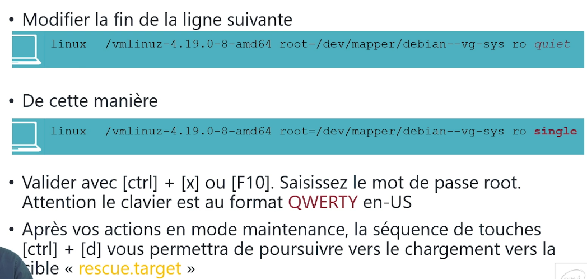

Sans mot de passe root ou en mode sudo.

Lors du démarrage, sélectionner Debian GNU/linux et appuyer sur « e », choisir la ligne du noyau voulu (ex : ligne linux) et appuyer sur « e ».

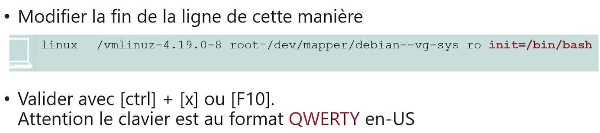

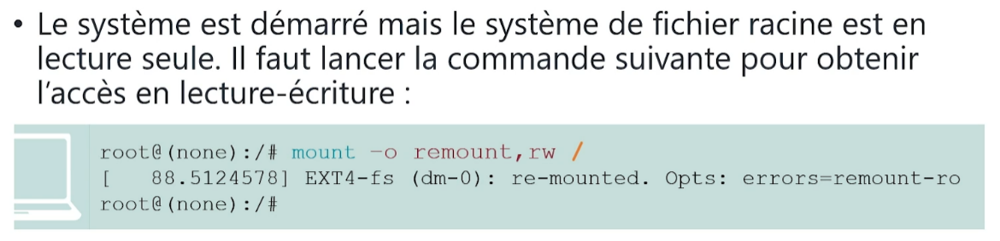

Lancer la commande passwd (attention mode qwerty)

Mode de maintenance avec CD-ROM

Changer l’ordre de démarrage sur la machine via le menu du bios. Pour cela, appuyer sur échappe rapidement avant l’apparition du premier menu debian ou VM/power on to firmware

Option de démarrage avancé, sur le CD-ROM drive, Rescue Mode.

Exécuter le shell sur root

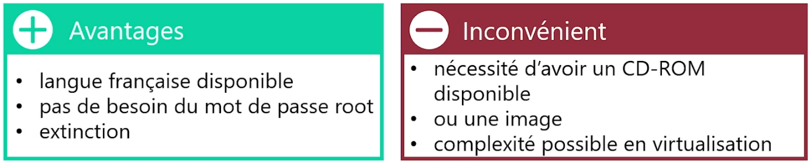

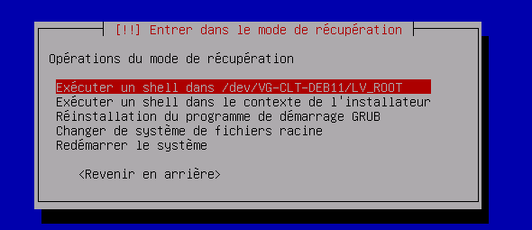

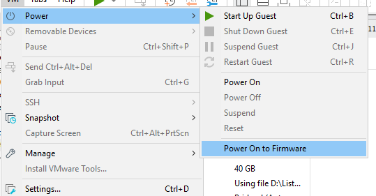

## Configurer une IP DHCP ou statique

Editer le fichier /etc/network/interfaces :

La configuration des directives nameserveur se trouve dans /etc/resolv.conf :

search mondomaine.fr mondomaine2.fr

Pour que les changements soient pris en compte, éteindre et allumer le service networking avec systemctl start/stop networking

Sur la partie graphique, gérer la connection avec la commande « nmtui » sur le terminal puis éteindre/allumer la connexion filaire pour prendre en compte les changements

# Les commandes utiles

## Fonctionnement système

Commande : systemctl – Gestion des services et processus système sous systemd

Options principales :

start <service> → Démarrer un service

stop <service> → Arrêter un service

restart <service> → Redémarrer un service

status <service> → Afficher le statut d’un service

enable <service> → Activer un service au démarrage

disable <service> → Désactiver un service au démarrage

list-units --type=service → Lister les services actifs

daemon-reexec → Recharger systemd sans redémarrer

Quelques services utiles :

systemctl get-default graphical.target  Affiche linux en GUI

systemctl get-default multi-user.target  Affiche linux en CLI

systemctl isolate rescue.target  Passe en mode maintenance

systemctl list-units  Liste les units du système

## Adresse IP

Commande : ip – Gestion des interfaces réseau, des adresses IP et des routes

🔹 Options principales

ip a ou ip addr → Afficher les adresses IP des interfaces

ip link → Lister les interfaces réseau

ip route → Afficher la table de routage

ip neigh → Voir le cache ARP

## Installation d’APT

Commande : apt – Gestionnaire de paquets pour les distributions Debian/Ubuntu

🔹 Options principales

apt update → Met à jour la liste des paquets disponibles

apt upgrade → Met à jour tous les paquets installés

apt install <paquet> → Installe un paquet

apt remove <paquet> → Désinstalle un paquet

apt autoremove → Supprime les paquets inutilisés

apt search <mot-clé> → Recherche un paquet

apt show <paquet> → Affiche les infos d’un paquet

apt list --installed → Liste les paquets installés

apt clean → Nettoie le cache des paquets téléchargés

Atp utile : vim (serveur + client) ; terminator (client graphique) ; wmwaretool : open-vm-tools(-desktop)

## Gestion des groupes et utilisateurs

UID = Identifiant utilisateur

GID = identifiant du groupe principal

3 types d’utilisateurs :

Root : UID = 0 / GID = 0 -> su - -> Super utilisateur

Daemons : UID 1-999, GID 1-999 -> Réservé pour les services

Utilisateur : UID et GID > 999

/etc/group et /etc/gshadow contiennent les informations sur les groupes. Il faut traiter les groupes avant les utilisateurs.

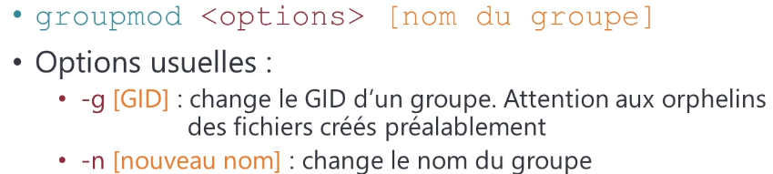

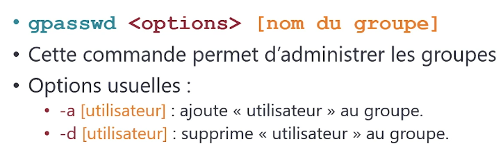

Les fichiers /etc/passwd et /etc/shadow gère les utilisateurs

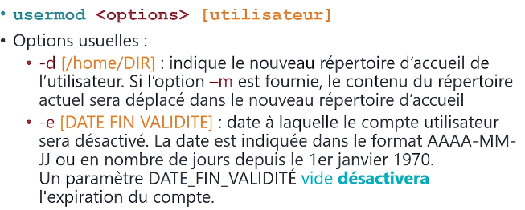

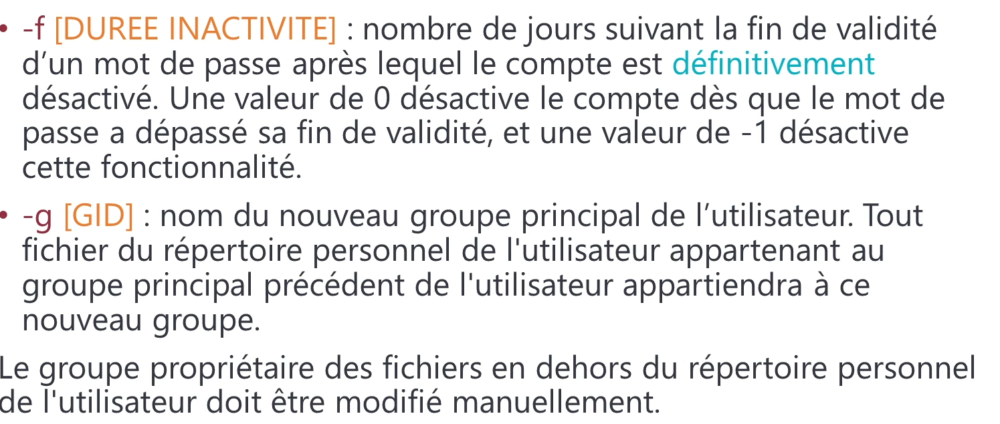

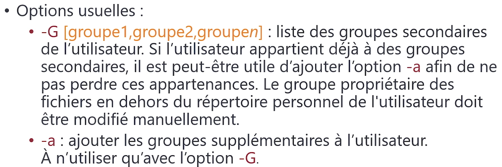

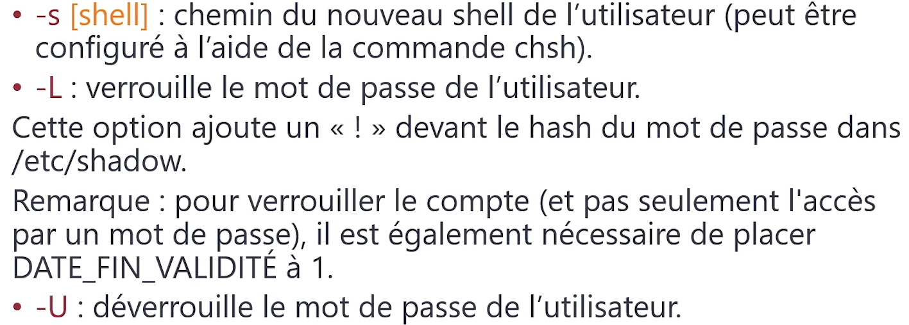

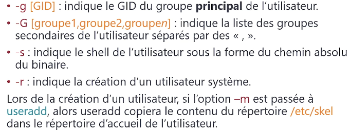

## Droit des fichiers

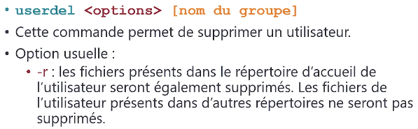

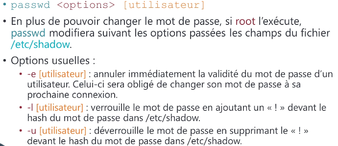

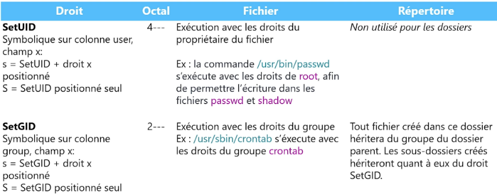

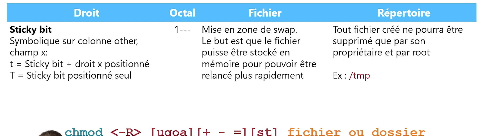

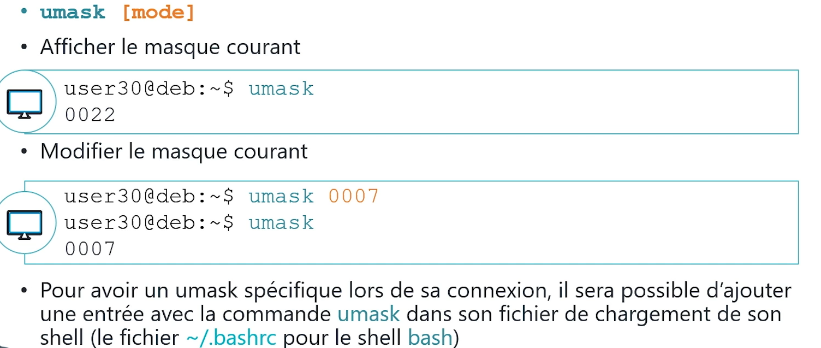

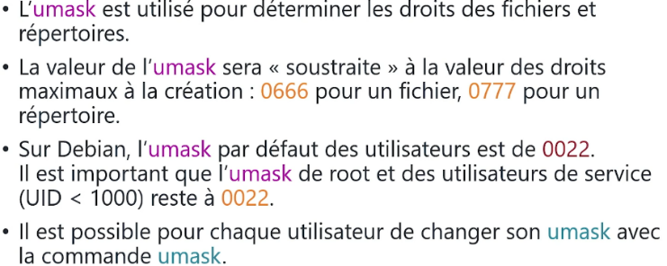

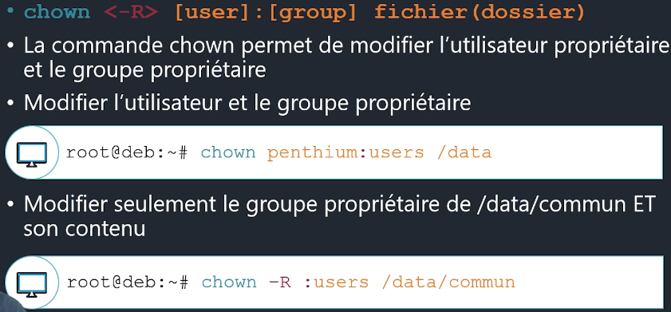

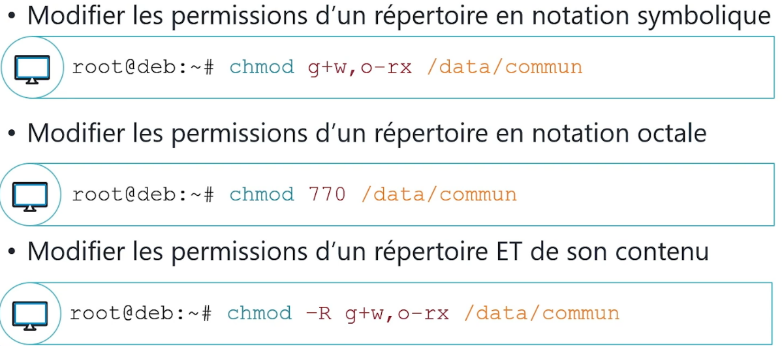

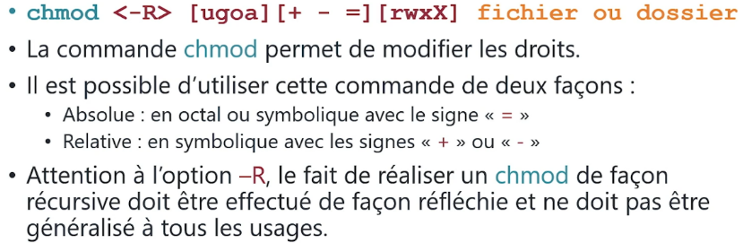

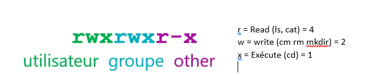

## Gestion des partitions LVM

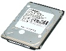

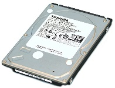

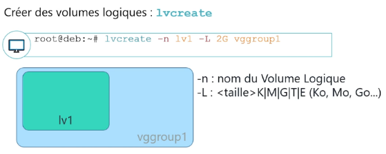

## Gestion avec filesystem

mkfs : Création d’un système de fichiers sous Linux

La commande mkfs (Make File System) est utilisée pour formater une partition ou un volume logique avec un système de fichiers afin qu’il puisse être utilisé pour stocker des données.

mkfs.ext4 /dev/sdb1  creation d’un syst de fichier format ext4 de la partition sdb1

mkfs.ext4/dev/sdb1/lvroot  creation d’un syst de sur volume logique

Options :

-L pour indiquer un label (conseillé) : mkfs.ext4 -L ‘’MONLABEL’’ /dev/sdb1

-v verbose

tune2fs : Modifier les paramètres d'un système de fichiers ext2/ext3/ext4

resize2fs : Redimensionner un système de fichiers ext2/ext3/ext4

resize2fs /dev/sdb1 10G  donne une taille de 10GB

resize2fs -L +10G /dev/sdb1  Ajoute 10 GB

resize2fs /dev/sdb1  Adapte a la taille du système

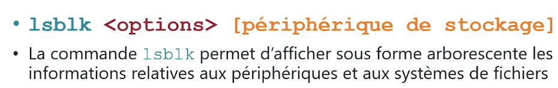

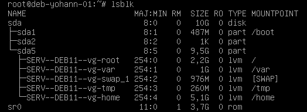

## Monter un système de fichier

Pour monter un système de fichier, on réalise en premier lieu un montage temporaire sur /mnt

Bonne pratique : créer un fichier vide (touch NON_MONTE) sur l’arborescence de /mnt avant le montage.

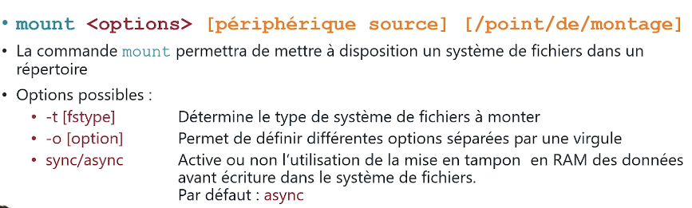

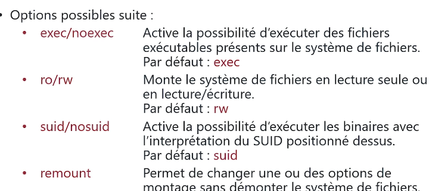

exemple :

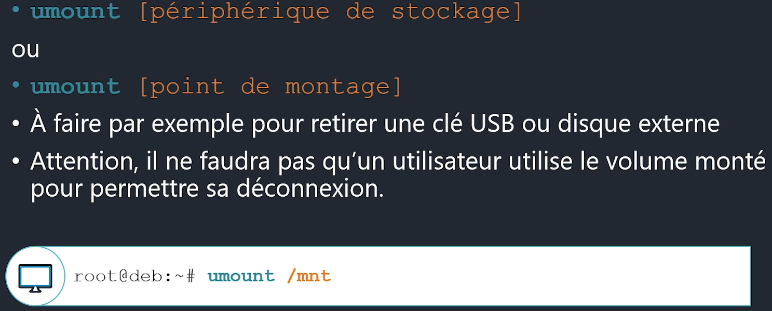

mount -t ext4 /sev/sdb1 /mnt

mount -t ext4 /sev/sdb1/lvhome /mnt

Pour voir facilement les points de montage, utiliser la commande findmnt

Avant de monter un nouveau system de fichier, pour créer la copie, commencer par réaliser une snapshot de la VM puis :

Démarrer en mode rescue : systemctl isolate rescue.target

stopper le service systemd avec systemctl stop system-j*

faire le montage temporaire

faire la copie avec toute les permissions via la commande cp. 
Exemple : cp -rpv /var/* /mnt/var/
r = récursif

P = permission préservée

V = verbeux

démonter le montage temporaire

remonter le volume final sur le / adéquat (exemple /var)

sortir du mode rescue : systemctl isolate graphical

contrôler la présence du montage sur le /var avec findmnt

ajouter le montage automatique sur le fichier /etc/fstab (via LABEL=VAR)

On contrôle en repassant en rescue et en demontant/remontant le volume (/var)

On reboot

## Maintenance d’un système en production

Commande : journalctl – Consultation des logs système avec systemd

La commande journalctl permet d'afficher et de filtrer les journaux du système gérés par systemd-journald.

Principales options :

Journalctl - Affiche tous les logs

journalctl -f :Suivi en temps réel des logs (équivalent tail -f)

journalctl -n 50	: Affiche les 50 dernières lignes

journalctl -u <service>	: Affiche les logs d’un service spécifique

journalctl -b : Affiche les logs du dernier démarrage

journalctl --since "2024-01-01"	Affiche les logs depuis une date spécifique

journalctl --since "1 hour ago"	Affiche les logs de la dernière heure

journalctl --until "2024-01-01 12:00:00"	Affiche les logs jusqu’à une date donnée

journalctl -p 3	Affiche uniquement les logs de priorité élevée (erreurs)

emerg	0	Urgence : le système est inutilisable

alert	1	Alerte : action immédiate requise (ex. disque plein)

crit	2	Critique : erreur grave (ex. panne matérielle)

err	3	Erreur : erreur non fatale

warning	4	Avertissement : problème potentiel

notice	5	Notification : événements normaux mais importants

info	6	Information : messages informatifs standards

debug	7	Débogage : messages détaillés pour les développeurs

journalctl --disk-usage	Affiche l’espace disque utilisé par les logs

journalctl --vacuum-time=7d	Supprime les logs de plus de 7 jours

journalctl --vacuum-size=500M	Réduit les logs à un maximum de 500 Mo

Commande : logger – Ajouter des messages aux logs système

La commande logger permet d'ajouter des messages personnalisés dans les logs du système, visibles avec journalctl ou /var/log/syslog (selon la configuration).

Tips :

Les informations relatives aux connexions sont situées dans /var/log/auth.log

La configuration des journaux de log (emplacement, systèmes concernés …) se trouve dans /etc/rsyslog.conf et de manière générale les logs se trouvent dans /var/log

## Planification des tâches

Commande : crontab – Planification de tâches automatiques sous Linux

La commande crontab permet de programmer l'exécution automatique de commandes à des horaires définis via le service cron.

Options principales de crontab :

crontab -e	Éditer le crontab de l'utilisateur actuel

crontab -l	Lister les tâches planifiées de l'utilisateur

crontab -r	Supprimer le crontab de l'utilisateur

crontab -i -r	Supprimer le crontab avec confirmation

crontab -u <user> -e	Modifier le crontab d’un autre utilisateur (nécessite sudo)

Chaque tâche dans crontab suit cette syntaxe :

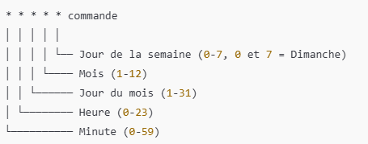

Exemple : 30 14 * * 1 /home/user/backup.sh  Exécute /home/user/backup.sh tous les lundis à 14h30.

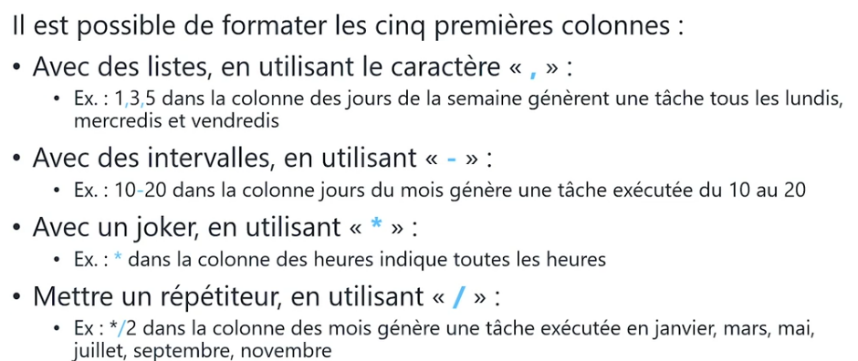

Les planifications systèmes sont situées dans /etc/crontab

Si le système n’est pas démarré lors de l’heure d’exécution d’un script, celui-ci ne s’exécutera pas et sera skip. C’est alors anacron qui permettra le lancement du script.

cron exécute des tâches à des horaires précis, mais il nécessite que le système soit allumé à ce moment précis.

anacron est utile pour les machines qui ne sont pas toujours allumées ou qui ne fonctionnent pas en continu, comme les laptops ou les serveurs qui ne tournent pas 24/7.

On peut réaliser une crontab avec l’utilisateur root pour simuler une crontab système

Les crontab systèmes peuvent être trouvées dans les /etc/cron.weekly pour semaine … c’est ici qu’il faut créer des liens symboliques vers les scritps.

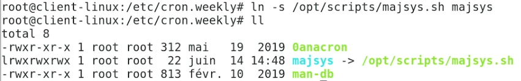

Ici, nous sommes dans la cron.weekly et nous avons ajouté un lien symbolique vers majsys.sh pour qu’il soit exécuté toute les semaines.
Les configs des différents cron.* sont dans /etc/crontab

## Tailles des logs

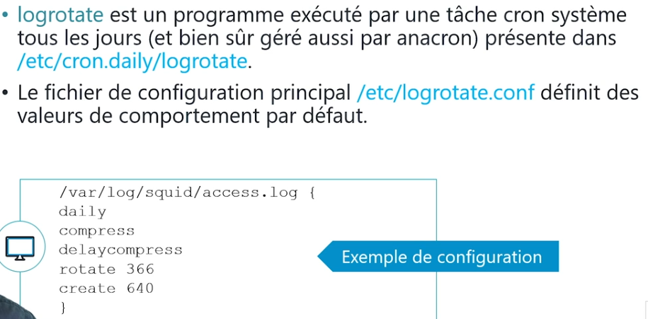

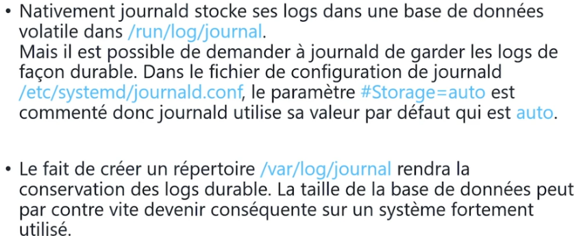

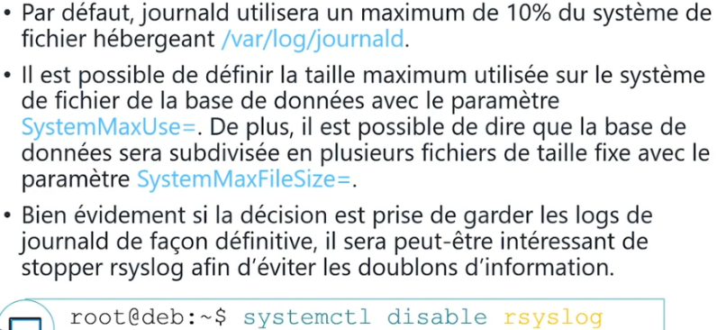

## Prendre des informations sur le système

Version de debian : cat /etc/debian_version

Version du kernel : uname -a

lscpu : Informations sur le processeur

lspci : Information sur le materiel pci

lsusb : Lister les périphériques usb

fdisk, pvs, vgs, lvs, lsblk, blkid, findmnt,

df (voir les espaces dispo fichier)

du -sh /root (voir la taille d’un répertoire)

file <fichier> : connaitre la nature d’un fichier

lsof informe sur les fichier utilisés par des processus (pour l’arreter et delect un fichier par exemple)

## Performance et processus

Commandes : top et htop (à installer) – Surveillance des ressources système

Options principales de top :

-d <seconds>	Définit un délai de rafraîchissement (par défaut, 3 secondes).

-u <user>	Filtre l'affichage pour ne montrer que les processus d'un utilisateur spécifique.

-p <pid>	Affiche les informations pour un processus spécifique.

-i	Ignore les processus inactifs (pour une vue plus claire des processus actifs).

-n <number>	Définit le nombre de rafraîchissements avant de quitter automatiquement.

Commande ps : Affiche les processus (ps -ef affiche tous les processus et ps -faux sous forme arbre)

Commande : free – Afficher l'utilisation de la mémoire système

Options principales de free :

-h	Affiche les tailles de mémoire dans un format lisible (Ko, Mo, Go).

-m	Affiche les résultats en Mo (Méga-octets).

-g	Affiche les résultats en Go (Giga-octets).

-s <seconds>	Rafraîchit l'affichage à intervalle régulier (en secondes).

-t	Affiche la mémoire totale (RAM + swap).

-w	Permet d'afficher la mémoire sans le cache et les buffers.

Commande last – Affiche les derniers user connectées

# Pour aller plus loin

## Grub

Grub est le chargeur de démarrage de debian

Pour savoir ou est installé grub (pour être sûre de ne pas le virer lors du changement d’un disque) utiliser la commande : grub-prob -t device /boot/grub

Les différents scripts de démarrage de grub sont stockés dans /etc/grub.d

00_header = entête

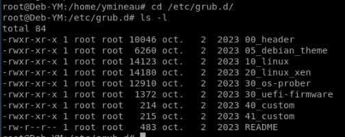

05_debian = thème

10_linux = script du lancement du système

20_linux_xen = script de lancement pour des versions xen de linux ou un hyperviseur

30_os_prober = Recherche si d’autre systèmes sont présents sur le serveur

40 et 41 = Paramètres perso à charger

Pour changer l’ordre des scripts, changer les chiffres.

Le 2eme fichier de config se trouve dans /etc/default  grub

Quelques options de ce fichier :

GRUB DEFAULT = Entrée de menu par défaut

GRUB TIMOUT = Durée d’affichage du menu en s

GRUB DISTRIBUTOR = Génération auto du texte de l’entrée de menu

LINUX DEFAULT = Paramètres de lancement

LINUX = Option du mode recovery

## Systemd

Unité (Unit) (= configuration d’un processus)

Une unité est un fichier de configuration utilisé par systemd pour gérer un élément du système.
Tout (services, cibles, montages, timers…) est une unité sous systemd.

Service (.service)

Un service est un processus en arrière-plan (daemon) géré par systemd.
Il peut être démarré, arrêté ou redémarré et peut s'exécuter automatiquement au démarrage.

systemctl list-units --type services : permet de lister les services

Target (.target)

Une target est un groupe logique d’unités permettant d'atteindre un état précis du système.
Elle remplace les anciens runlevels de SysVinit.

systemctl list-units --type target –all : Permet de voir les targets

Exemples de targets :

multi-user.target → Mode texte multi-utilisateur (équivalent runlevel 3)

graphical.target → Mode graphique (équivalent runlevel 5)

rescue.target → Mode maintenance

Processus

Un processus est un programme en cours d'exécution.
Chaque processus a un identifiant unique (PID).

ps aux : Permet de lister les processus (ou top/htop)

pstree : Affichage sous forme d’arbre

Systemd :

Composé de 2 repertoires : /lib/systemd/system et /etc/systemd/system (unité ajoutée pour améliorer un service)  Via la commande systemctl edit #SERVICE

Systemctl list-units --all permet de voir toutes les unités du système chargée ou pas

Filtrage par type avec le - - type=servies

Filtrage par état avec le - - state=active

Voir la cible par defaut du system : systemctl get-default

Modifier la cible : systemctl set-default #### multi-user ou graphical-user

Changer temporairement une cible avec isolate : systemctl isolate #target (ex : rescue target)

## Les services

Pour recharger la config d’un service sans l’arrêter : systemctl reload #SERVICE

NE fonctionne pas avec tous les services mais peut être utile pour mettre à jour un service sans déconnecter les utilisateurs.

Sinon utiliser systemctl reload-or-restart #Service

Les propriétés d’un service

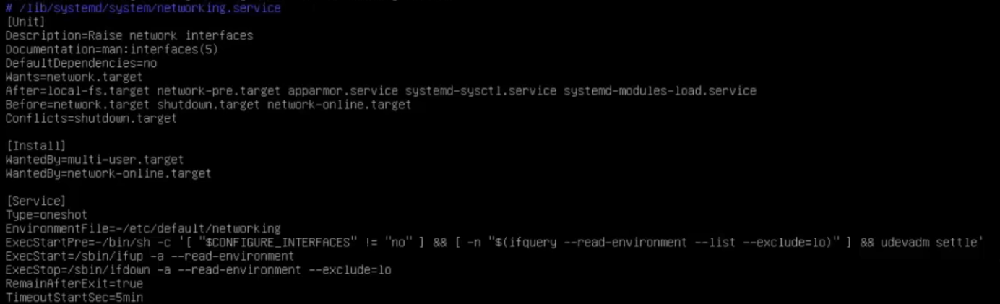

Wants = dependences

Wantedby = Nécéssaires pour

After = est chargé après donc After = liste des services chargé avant

Before = Chargé après

Conflics = Ne peut être chargé avec (creation de conflit)

Création d’un service

Un service peut être créé à partir d’un service existant (cp d’un service dans /etc/systemd/system)

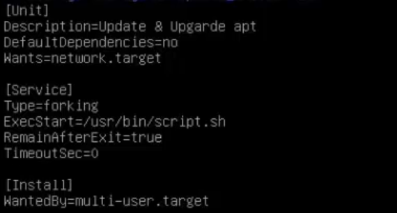

Il doit être exécutable au niveau des droits (chmod)

Exemple de service faisant une mise à jour des apts au démarrage :

(penser à le mettre démarrable au démarrage avec enable et start)

## La protection des données

Le raid logiciel : Paquet mdadm  Donne un service mdmonitor.service

Lister les disques : lsblk (ls les périphériques de type block) ou fdisk -l

## La sauvegarde

Sauvegarde intégrale = tout sauvegarder

Sauvegarde incrémentielle = Compare l’état des données actuelles et de la dernière sauvegardes (complète ou partielle)  Copie la différence depuis la dernière sauvegarde

Sauvegarde différentielle = Compare l’état actuelle des données avec la dernière sauvegarde complète  Sauvegarde les différences

Outil dd : Permet de copier des fichiers et disques par bloc (attention à la syntaxe).

dd if=/dev/sdb of=/dev/sdd conv=noerror,sync status=progress

if = Input file = périphérique ou dossier source

of = Output file = Périphérique, ou dossier de sortie  Peut être un fichier pour créer une image

conv  Option

noerror : continuer en cas d’erreur

sync : Remplir avec des 0 les blocs erronés

status=progress : affiche la progression

La commande peut être complétée d’un   | gzip -c > /$HOME/image.img.gz pour compresser l’image crée

Restaurer un disque à partir d’une image

Gunzip -c /$HOME/ image.img.gz | dd of=/dev/sdd

Effacer un disque complètement pour protéger les données : dd if=/dev/zero of=DISQUEAEFFACER

## DUMP

dump -0avf FICHIEROUTPUT	INPUT  dump -0avf /tmp/dump201905 /home (copie du /home)

Plusieurs niveaux de dump :

0 : Sauvegarde intégrale

1 à 9  Permet de faire des backups différentiels entre les niveaux 1 à 9. (1 = backup différentiel depuis 0, 2 depuis 1, x depuis inférieur)

a  Définit la taille automatiquement en fonction du support

v  Verbeux

f  Fichier de sauvegarde

n  Compression

Restauration avec restore -if CHEMINIMAGE  Interface de navigation ou l’on doit choisir les fichiers/dossiers à restaurer avec « add FICHIEROUDOSSIER ». (delect pour supprimer).

Restauration intégrale avec restore -rf CHEMINFICHIER.img

Souvent associé à une crontab pour programmer des sauvegardes incrémentielles.

## Journalctl

journalctl

-b  Voir les logs au démarrage

-e  Voir les derniers logs

-o  Pour formater (short, verbose (=long), export (pour exporter en json)).

-k  Journaux du noyau

-u  Filtre par unité (Ex : journalctl -u networking : Filtre les évènements liés à l’unité networking)

-f  Afficher les journaux en temps réels

-p  1 à 6 pour la priorité (0 urgence, 1 alerte, 2 crit, 3 error, 4 warning…)

-- disk-usage  Taille des journaux

